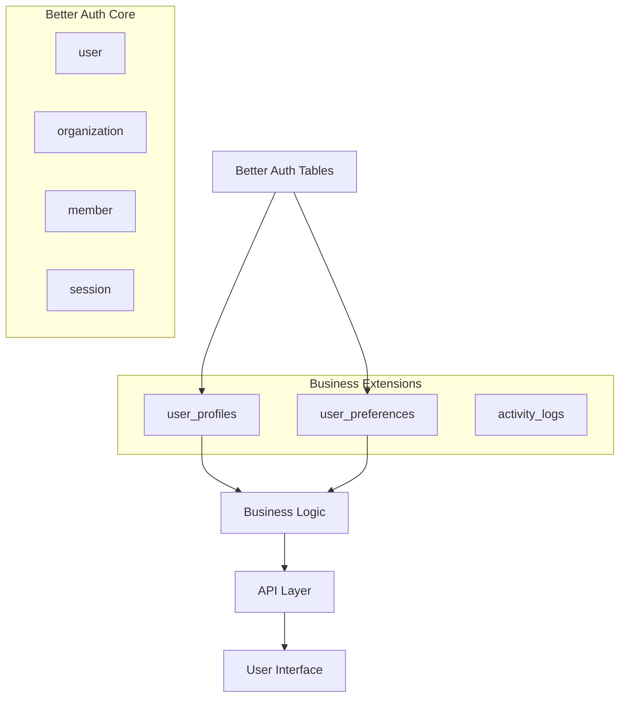

# Business Extension Tables - Technical Design

## Overview

This design document outlines the implementation of business extension tables that extend Better Auth with Tender Track 360-specific user data. The solution provides user profiles with business roles and comprehensive user preferences while maintaining clean separation from the authentication system.

## Architecture

### System Integration



### Design Principles

1. **Separation of Concerns**: Better Auth handles authentication, business tables handle domain logic
2. **Multi-Tenancy**: All business data scoped to organizations
3. **Audit Trail**: Comprehensive logging of all profile and preference changes
4. **Performance**: Optimized indexes for common query patterns
5. **Flexibility**: JSON fields for extensible preferences

## Components and Interfaces

### 1. Database Schema Design

#### User Profiles Table

```typescript
export const userProfiles = pgTable(
  'user_profiles',
  {
    id: uuid('id').primaryKey().defaultRandom(),
    userId: text('user_id')
      .notNull()
      .unique()
      .references(() => user.id, { onDelete: 'cascade' }),
    organizationId: text('organization_id')
      .notNull()
      .references(() => organization.id, { onDelete: 'cascade' }),

    // Business Role (separate from Better Auth role)
    businessRole: userRoleEnum('business_role').notNull().default('viewer'),
    department: varchar('department', { length: 100 }),

    // Status Management
    isActive: boolean('is_active').notNull().default(true),
    lastLogin: timestamp('last_login', { withTimezone: true }),
    onboardingCompleted: boolean('onboarding_completed')
      .notNull()
      .default(false),

    // Soft Deletion for Audit Trail
    isDeleted: boolean('is_deleted').notNull().default(false),
    deletedAt: timestamp('deleted_at', { withTimezone: true }),
    deletedById: text('deleted_by_id').references(() => user.id),

    // Audit Fields
    createdAt: timestamp('created_at', { withTimezone: true })
      .notNull()
      .defaultNow(),
    updatedAt: timestamp('updated_at', { withTimezone: true })
      .notNull()
      .defaultNow(),
    createdById: text('created_by_id').references(() => user.id),
    updatedById: text('updated_by_id').references(() => user.id),
  },
  (t) => [
    // Performance Indexes
    index('idx_user_profiles_org_active').on(t.organizationId, t.isActive),
    index('idx_user_profiles_user').on(t.userId),
    index('idx_user_profiles_role').on(t.businessRole),
    index('idx_user_profiles_department').on(t.department, t.organizationId),
    index('idx_user_profiles_last_login').on(t.lastLogin),

    // Unique constraint: one profile per user per organization
    uniqueIndex('idx_user_profiles_unique').on(t.userId, t.organizationId),
  ]
);
```

#### User Preferences Table

```typescript
export const userPreferences = pgTable(
  'user_preferences',
  {
    id: uuid('id').primaryKey().defaultRandom(),
    userId: text('user_id')
      .notNull()
      .references(() => user.id, { onDelete: 'cascade' }),
    organizationId: text('organization_id').references(() => organization.id, {
      onDelete: 'cascade',
    }),

    // Notification Preferences
    emailNotifications: boolean('email_notifications').notNull().default(true),
    pushNotifications: boolean('push_notifications').notNull().default(true),

    // Notification Type Controls (JSON for flexibility)
    notificationSettings: jsonb('notification_settings')
      .$type<{
        deadlineReminders: boolean;
        statusChanges: boolean;
        taskAssignments: boolean;
        documentUpdates: boolean;
        extensionRequests: boolean;
        systemAlerts: boolean;
      }>()
      .default({
        deadlineReminders: true,
        statusChanges: true,
        taskAssignments: true,
        documentUpdates: true,
        extensionRequests: true,
        systemAlerts: true,
      }),

    // Reminder Timing
    reminderDays: integer('reminder_days').notNull().default(7),

    // Regional Preferences
    timezone: varchar('timezone', { length: 50 }).default('UTC'),
    language: varchar('language', { length: 10 }).default('en'),
    dateFormat: varchar('date_format', { length: 20 }).default('MM/dd/yyyy'),
    timeFormat: varchar('time_format', { length: 10 }).default('12h'),

    // Dashboard Customization
    dashboardSettings: jsonb('dashboard_settings')
      .$type<{
        defaultView: 'list' | 'grid' | 'calendar';
        widgetOrder: string[];
        compactMode: boolean;
        showCompletedTasks: boolean;
      }>()
      .default({
        defaultView: 'list',
        widgetOrder: ['tenders', 'tasks', 'deadlines'],
        compactMode: false,
        showCompletedTasks: false,
      }),

    // Scope: null = global, organizationId = org-specific
    isGlobal: boolean('is_global').notNull().default(true),

    // Audit Fields
    createdAt: timestamp('created_at', { withTimezone: true })
      .notNull()
      .defaultNow(),
    updatedAt: timestamp('updated_at', { withTimezone: true })
      .notNull()
      .defaultNow(),
  },
  (t) => [
    index('idx_user_preferences_user').on(t.userId),
    index('idx_user_preferences_org').on(t.organizationId),
    index('idx_user_preferences_global').on(t.isGlobal),

    // Unique constraint: one global preference per user, one org preference per user per org
    uniqueIndex('idx_user_preferences_unique_global')
      .on(t.userId)
      .where(sql`is_global = true`),
    uniqueIndex('idx_user_preferences_unique_org')
      .on(t.userId, t.organizationId)
      .where(sql`is_global = false`),
  ]
);
```

#### Business Role Enum

```typescript
export const userRoleEnum = pgEnum('user_role', [
  'admin', // Full system access within organization
  'tender_manager', // Manage tenders, assign tasks, view reports
  'tender_specialist', // Create/edit assigned tenders, manage documents
  'viewer', // Read-only access to assigned tenders
]);
```

### 2. Data Models and Types

#### TypeScript Interfaces

```typescript
// User Profile Types
export type UserProfile = typeof userProfiles.$inferSelect;
export type NewUserProfile = typeof userProfiles.$inferInsert;

export type UserProfileWithUser = UserProfile & {
  user: User;
  organization: Organization;
  createdBy?: User;
  updatedBy?: User;
  deletedBy?: User;
};

// User Preferences Types
export type UserPreferences = typeof userPreferences.$inferSelect;
export type NewUserPreferences = typeof userPreferences.$inferInsert;

export type NotificationSettings = {
  deadlineReminders: boolean;
  statusChanges: boolean;
  taskAssignments: boolean;
  documentUpdates: boolean;
  extensionRequests: boolean;
  systemAlerts: boolean;
};

export type DashboardSettings = {
  defaultView: 'list' | 'grid' | 'calendar';
  widgetOrder: string[];
  compactMode: boolean;
  showCompletedTasks: boolean;
};

// Combined User Context
export type UserContext = {
  user: User;
  profile: UserProfile;
  preferences: UserPreferences;
  organizationRole: Role; // Better Auth role
  businessRole: UserRole; // Business role
  permissions: string[];
};
```

### 3. Database Relations

```typescript
// User Profile Relations
export const userProfileRelations = relations(userProfiles, ({ one }) => ({
  user: one(user, {
    fields: [userProfiles.userId],
    references: [user.id],
  }),
  organization: one(organization, {
    fields: [userProfiles.organizationId],
    references: [organization.id],
  }),
  createdBy: one(user, {
    fields: [userProfiles.createdById],
    references: [user.id],
  }),
  updatedBy: one(user, {
    fields: [userProfiles.updatedById],
    references: [user.id],
  }),
  deletedBy: one(user, {
    fields: [userProfiles.deletedById],
    references: [user.id],
  }),
}));

// User Preferences Relations
export const userPreferencesRelations = relations(
  userPreferences,
  ({ one }) => ({
    user: one(user, {
      fields: [userPreferences.userId],
      references: [user.id],
    }),
    organization: one(organization, {
      fields: [userPreferences.organizationId],
      references: [organization.id],
    }),
  })
);
```

## Data Models

### User Profile Management Service

```typescript
export class UserProfileService {
  // Create profile when user joins organization
  async createProfile(data: {
    userId: string;
    organizationId: string;
    businessRole: UserRole;
    department?: string;
    createdById: string;
  }): Promise<UserProfile>;

  // Update profile information
  async updateProfile(
    profileId: string,
    updates: Partial<UserProfile>,
    updatedById: string
  ): Promise<UserProfile>;

  // Soft delete profile
  async deleteProfile(profileId: string, deletedById: string): Promise<void>;

  // Get user context (profile + preferences + permissions)
  async getUserContext(
    userId: string,
    organizationId: string
  ): Promise<UserContext>;

  // Update last login
  async updateLastLogin(userId: string, organizationId: string): Promise<void>;

  // Complete onboarding
  async completeOnboarding(
    userId: string,
    organizationId: string
  ): Promise<void>;
}
```

### User Preferences Service

```typescript
export class UserPreferencesService {
  // Create default preferences
  async createDefaultPreferences(
    userId: string,
    organizationId?: string
  ): Promise<UserPreferences>;

  // Update preferences
  async updatePreferences(
    userId: string,
    updates: Partial<UserPreferences>,
    organizationId?: string
  ): Promise<UserPreferences>;

  // Get effective preferences (org-specific overrides global)
  async getEffectivePreferences(
    userId: string,
    organizationId: string
  ): Promise<UserPreferences>;

  // Update notification settings
  async updateNotificationSettings(
    userId: string,
    settings: Partial<NotificationSettings>,
    organizationId?: string
  ): Promise<void>;

  // Update dashboard settings
  async updateDashboardSettings(
    userId: string,
    settings: Partial<DashboardSettings>,
    organizationId?: string
  ): Promise<void>;
}
```

## Error Handling

### Validation Rules

1. **Profile Validation**:
   - User must exist in Better Auth
   - Organization must exist and user must be a member
   - Business role must be valid enum value
   - Department length must not exceed 100 characters

2. **Preference Validation**:
   - Timezone must be valid IANA timezone
   - Language must be supported locale
   - Date/time formats must be valid
   - Notification settings must be boolean values

3. **Business Logic Validation**:
   - Only organization admins can assign admin business roles
   - Users cannot delete their own profiles
   - Soft-deleted profiles cannot be modified

### Error Types

```typescript
export class ProfileError extends Error {
  constructor(
    message: string,
    public code:
      | 'PROFILE_NOT_FOUND'
      | 'INVALID_ROLE'
      | 'PERMISSION_DENIED'
      | 'VALIDATION_ERROR',
    public details?: any
  ) {
    super(message);
  }
}
```

## Testing Strategy

### Unit Tests

1. **Profile Service Tests**:
   - Profile creation with valid/invalid data
   - Profile updates and soft deletion
   - Permission validation
   - Multi-organization scenarios

2. **Preferences Service Tests**:
   - Default preference creation
   - Preference inheritance (global vs org-specific)
   - Notification setting updates
   - Dashboard customization

### Integration Tests

1. **Database Integration**:
   - Foreign key constraints
   - Index performance
   - Transaction handling
   - Soft deletion behavior

2. **Better Auth Integration**:
   - Profile creation on user registration
   - Profile cleanup on user deletion
   - Organization membership changes

### Performance Tests

1. **Query Performance**:
   - Profile lookups by organization
   - Preference loading for dashboard
   - Bulk user operations
   - Index effectiveness

## Security Considerations

### Data Access Control

1. **Row-Level Security**: Users can only access profiles within their organizations
2. **Role-Based Access**: Business role determines what profile data can be viewed/modified
3. **Audit Trail**: All changes logged with user attribution
4. **Soft Deletion**: Preserve data for compliance while marking as deleted

### Privacy Protection

1. **Data Minimization**: Only store necessary profile information
2. **Preference Privacy**: Users control their own preferences
3. **Organization Boundaries**: Strict data isolation between organizations
4. **Retention Policies**: Configurable data retention for deleted profiles

## Migration Strategy

### Phase 1: Schema Creation

1. Create new tables with indexes
2. Add foreign key constraints
3. Set up default values and constraints

### Phase 2: Data Migration

1. Create default profiles for existing users
2. Set up default preferences based on current settings
3. Migrate any existing role data

### Phase 3: Application Integration

1. Update authentication middleware to load user context
2. Modify UI to use business roles
3. Implement preference-based customization

### Phase 4: Cleanup

1. Remove deprecated role fields
2. Optimize queries based on usage patterns
3. Fine-tune indexes for performance

This design provides a robust foundation for extending Better Auth with business-specific functionality while maintaining clean separation of concerns and supporting the multi-tenant nature of Tender Track 360.
