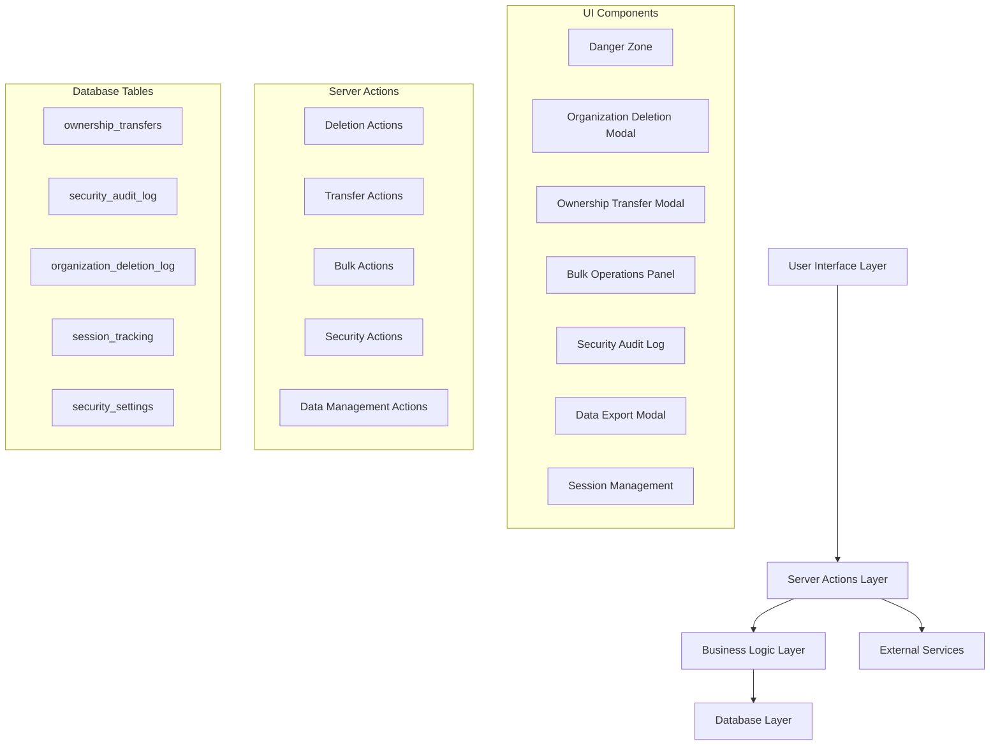

# Design Document

## Overview

This design implements safe organization deletion with comprehensive safeguards and advanced management features including ownership transfer, bulk operations, and enhanced security. The system builds upon the existing organization management architecture while adding new database tables, server actions, and UI components to support advanced organizational operations.

The design follows a multi-layered security approach with extensive validation, audit logging, and user confirmation processes to prevent accidental data loss while providing powerful management capabilities for organization administrators.

## Architecture

### High-Level Architecture



### Security Architecture

The system implements multiple security layers:

1. **Permission Layer**: Role-based access control with hierarchical permissions
2. **Validation Layer**: Multi-step confirmation processes with typed verification
3. **Audit Layer**: Comprehensive logging of all security-sensitive operations
4. **Data Protection Layer**: Secure deletion and data sanitization
5. **Session Management**: Organization-scoped session tracking and monitoring

## Components and Interfaces

### Database Schema Extensions

#### New Tables

```sql
-- Ownership transfers tracking
CREATE TABLE ownership_transfers (
  id TEXT PRIMARY KEY,
  organization_id TEXT NOT NULL REFERENCES organization(id) ON DELETE CASCADE,
  from_user_id TEXT NOT NULL REFERENCES user(id) ON DELETE CASCADE,
  to_user_id TEXT NOT NULL REFERENCES user(id) ON DELETE CASCADE,
  status TEXT DEFAULT 'pending' CHECK (status IN ('pending', 'accepted', 'cancelled', 'expired')),
  transfer_token TEXT UNIQUE NOT NULL,
  created_at TIMESTAMP DEFAULT NOW(),
  expires_at TIMESTAMP NOT NULL,
  accepted_at TIMESTAMP,
  cancelled_at TIMESTAMP,
  metadata JSONB
);

-- Security audit logging
CREATE TABLE security_audit_log (
  id TEXT PRIMARY KEY,
  organization_id TEXT NOT NULL REFERENCES organization(id) ON DELETE CASCADE,
  user_id TEXT NOT NULL REFERENCES user(id) ON DELETE CASCADE,
  action TEXT NOT NULL,
  resource_type TEXT NOT NULL,
  resource_id TEXT,
  details JSONB,
  ip_address TEXT,
  user_agent TEXT,
  session_id TEXT,
  severity TEXT DEFAULT 'info' CHECK (severity IN ('info', 'warning', 'critical')),
  created_at TIMESTAMP DEFAULT NOW()
);

-- Organization deletion tracking with soft delete support
CREATE TABLE organization_deletion_log (
  id TEXT PRIMARY KEY,
  organization_id TEXT NOT NULL,
  organization_name TEXT NOT NULL,
  deleted_by TEXT NOT NULL REFERENCES user(id),
  deletion_reason TEXT,
  deletion_type TEXT DEFAULT 'soft' CHECK (deletion_type IN ('soft', 'permanent')),
  data_exported BOOLEAN DEFAULT FALSE,
  export_format TEXT,
  confirmation_token TEXT NOT NULL,
  related_data_count JSONB, -- {tenders: 5, contracts: 2, members: 10}
  soft_deleted_at TIMESTAMP DEFAULT NOW(),
  permanent_deletion_scheduled_at TIMESTAMP,
  permanent_deleted_at TIMESTAMP,
  restored_at TIMESTAMP,
  restored_by TEXT REFERENCES user(id),
  metadata JSONB
);

-- Enhanced session tracking
CREATE TABLE session_tracking (
  id TEXT PRIMARY KEY,
  session_id TEXT NOT NULL REFERENCES session(id) ON DELETE CASCADE,
  organization_id TEXT REFERENCES organization(id) ON DELETE CASCADE,
  login_time TIMESTAMP DEFAULT NOW(),
  last_activity TIMESTAMP DEFAULT NOW(),
  ip_address TEXT,
  user_agent TEXT,
  device_info JSONB,
  location_info JSONB,
  is_suspicious BOOLEAN DEFAULT FALSE,
  logout_time TIMESTAMP
);

-- Organization security settings
CREATE TABLE organization_security_settings (
  id TEXT PRIMARY KEY,
  organization_id TEXT NOT NULL REFERENCES organization(id) ON DELETE CASCADE,
  require_2fa BOOLEAN DEFAULT FALSE,
  ip_whitelist JSONB, -- Array of allowed IP addresses/ranges
  session_timeout INTEGER DEFAULT 86400, -- seconds
  max_concurrent_sessions INTEGER DEFAULT 5,
  login_attempt_limit INTEGER DEFAULT 5,
  lockout_duration INTEGER DEFAULT 900, -- seconds
  password_policy JSONB,
  audit_retention_days INTEGER DEFAULT 365,
  auto_permanent_delete_days INTEGER DEFAULT 30, -- Days before soft deleted orgs are permanently deleted
  created_at TIMESTAMP DEFAULT NOW(),
  updated_at TIMESTAMP DEFAULT NOW()
);
```

#### Schema Modifications

```sql
-- Add soft deletion fields to organization table
ALTER TABLE organization ADD COLUMN deleted_at TIMESTAMP;
ALTER TABLE organization ADD COLUMN deleted_by TEXT REFERENCES user(id);
ALTER TABLE organization ADD COLUMN deletion_reason TEXT;
ALTER TABLE organization ADD COLUMN permanent_deletion_scheduled_at TIMESTAMP;

-- Add soft deletion to related tables
ALTER TABLE tender ADD COLUMN deleted_at TIMESTAMP;
ALTER TABLE tender ADD COLUMN deleted_by TEXT REFERENCES user(id);
ALTER TABLE contract ADD COLUMN deleted_at TIMESTAMP;
ALTER TABLE contract ADD COLUMN deleted_by TEXT REFERENCES user(id);
ALTER TABLE follow_up ADD COLUMN deleted_at TIMESTAMP;
ALTER TABLE follow_up ADD COLUMN deleted_by TEXT REFERENCES user(id);

-- Add security fields to session table (already exists but enhance)
ALTER TABLE session ADD COLUMN organization_context TEXT;
ALTER TABLE session ADD COLUMN security_flags JSONB;
```

### Core Interfaces

```typescript
// Deletion interfaces
interface DeletionConfirmation {
  organizationName: string;
  confirmationPhrase: string;
  dataExportRequested: boolean;
  exportFormat?: 'json' | 'csv';
  deletionType: 'soft' | 'permanent';
  reason?: string;
}

interface DeletionResult {
  success: boolean;
  deletionId: string;
  deletionType: 'soft' | 'permanent';
  exportUrl?: string;
  permanentDeletionScheduledAt?: Date;
  affectedRecords: {
    tenders: number;
    contracts: number;
    members: number;
    followUps: number;
  };
}

interface SoftDeletedOrganization {
  id: string;
  name: string;
  deletedAt: Date;
  deletedBy: string;
  permanentDeletionScheduledAt: Date;
  daysUntilPermanentDeletion: number;
  canRestore: boolean;
  canPermanentlyDelete: boolean;
}

// Ownership transfer interfaces
interface OwnershipTransferRequest {
  organizationId: string;
  newOwnerId: string;
  reason?: string;
  transferMessage?: string;
}

interface OwnershipTransfer {
  id: string;
  organizationId: string;
  fromUserId: string;
  toUserId: string;
  status: 'pending' | 'accepted' | 'cancelled' | 'expired';
  transferToken: string;
  expiresAt: Date;
  metadata?: Record<string, unknown>;
}

// Bulk operations interfaces
interface BulkMemberUpdate {
  memberId: string;
  newRole: Role;
  reason?: string;
}

interface BulkOperationResult {
  success: boolean;
  processed: number;
  failed: number;
  errors: Array<{
    memberId: string;
    error: string;
  }>;
  rollbackToken?: string;
}

// Security interfaces
interface SecurityAuditEntry {
  id: string;
  organizationId: string;
  userId: string;
  action: string;
  resourceType: string;
  resourceId?: string;
  details: Record<string, unknown>;
  ipAddress?: string;
  userAgent?: string;
  severity: 'info' | 'warning' | 'critical';
  createdAt: Date;
}

interface SecuritySettings {
  require2FA: boolean;
  ipWhitelist?: string[];
  sessionTimeout: number;
  maxConcurrentSessions: number;
  loginAttemptLimit: number;
  lockoutDuration: number;
  auditRetentionDays: number;
}
```

### UI Components

#### DangerZone Component

```typescript
interface DangerZoneProps {
  organizationId: string;
  userRole: Role;
  organizationName: string;
  memberCount: number;
  hasActiveContracts: boolean;
}
```

#### OrganizationDeletionModal Component

```typescript
interface OrganizationDeletionModalProps {
  isOpen: boolean;
  onClose: () => void;
  organization: {
    id: string;
    name: string;
    memberCount: number;
    tenderCount: number;
    contractCount: number;
  };
  onConfirm: (confirmation: DeletionConfirmation) => Promise<void>;
}
```

#### OwnershipTransferModal Component

```typescript
interface OwnershipTransferModalProps {
  isOpen: boolean;
  onClose: () => void;
  organizationId: string;
  eligibleMembers: Array<{
    id: string;
    name: string;
    email: string;
    role: Role;
  }>;
  onTransfer: (request: OwnershipTransferRequest) => Promise<void>;
}
```

## Data Models

### Enhanced Organization Model

```typescript
interface OrganizationWithDeletionInfo extends Organization {
  deletionScheduledAt?: Date;
  deletionToken?: string;
  isDeleted: boolean;
  securitySettings?: SecuritySettings;
  activeTransfers?: OwnershipTransfer[];
  memberCount: number;
  tenderCount: number;
  contractCount: number;
  lastActivity: Date;
}
```

### Audit Trail Model

```typescript
interface AuditTrail {
  entries: SecurityAuditEntry[];
  totalCount: number;
  filters: {
    dateRange?: [Date, Date];
    actions?: string[];
    severity?: string[];
    users?: string[];
  };
  pagination: {
    page: number;
    limit: number;
    hasMore: boolean;
  };
}
```

### Session Management Model

```typescript
interface OrganizationSession {
  id: string;
  userId: string;
  userName: string;
  organizationId: string;
  loginTime: Date;
  lastActivity: Date;
  ipAddress: string;
  userAgent: string;
  deviceInfo: {
    browser?: string;
    os?: string;
    device?: string;
  };
  locationInfo?: {
    country?: string;
    city?: string;
  };
  isSuspicious: boolean;
  isActive: boolean;
}
```

## Error Handling

### Error Categories

1. **Permission Errors**: Insufficient privileges for operations
2. **Validation Errors**: Invalid input data or confirmation failures
3. **Business Logic Errors**: Violations of business rules (e.g., deleting organization with active contracts)
4. **System Errors**: Database failures, external service errors
5. **Security Errors**: Suspicious activity, rate limiting violations

### Error Response Format

```typescript
interface ErrorResponse {
  success: false;
  error: {
    code: string;
    message: string;
    details?: unknown;
    retryable?: boolean;
    suggestions?: string[];
  };
}
```

### Error Handling Strategy

- **Graceful Degradation**: Non-critical features fail silently with logging
- **User Feedback**: Clear, actionable error messages for user-facing errors
- **Audit Logging**: All errors logged with context for debugging
- **Rollback Support**: Transactional operations with rollback capabilities
- **Rate Limiting**: Prevent abuse of sensitive operations

## Testing Strategy

### Unit Testing

1. **Permission Validation**: Test all role-based access controls
2. **Data Validation**: Test input sanitization and validation logic
3. **Business Logic**: Test deletion workflows, transfer processes
4. **Security Functions**: Test audit logging, session management
5. **Error Handling**: Test error scenarios and edge cases

### Integration Testing

1. **End-to-End Workflows**: Complete deletion and transfer processes
2. **Database Transactions**: Test rollback scenarios and data integrity
3. **Email Notifications**: Test notification delivery and content
4. **Bulk Operations**: Test with various data sizes and failure scenarios
5. **Security Audit**: Test comprehensive logging across operations

### Security Testing

1. **Permission Bypass**: Attempt unauthorized operations
2. **Input Validation**: Test SQL injection, XSS prevention
3. **Rate Limiting**: Test abuse prevention mechanisms
4. **Data Sanitization**: Verify secure deletion processes
5. **Session Security**: Test session hijacking prevention

### Performance Testing

1. **Bulk Operations**: Test with large datasets (1000+ members)
2. **Deletion Performance**: Test with organizations containing extensive data
3. **Audit Log Queries**: Test search and filtering performance
4. **Concurrent Operations**: Test multiple simultaneous operations
5. **Memory Usage**: Monitor resource consumption during operations

## Security Considerations

### Data Protection

- **Secure Deletion**: Multi-pass data sanitization for sensitive information
- **Encryption**: Encrypt audit logs and sensitive metadata
- **Access Logging**: Log all access to sensitive operations
- **Data Minimization**: Only collect necessary information for operations

### Authentication & Authorization

- **Multi-Factor Authentication**: Required for high-risk operations
- **Role Hierarchy**: Strict enforcement of permission levels
- **Session Management**: Secure session handling with timeout controls
- **IP Restrictions**: Optional IP whitelisting for enhanced security

### Audit & Compliance

- **Comprehensive Logging**: All operations logged with full context
- **Tamper Protection**: Audit logs protected from modification
- **Retention Policies**: Configurable data retention periods
- **Export Capabilities**: Support for compliance reporting and data portability

### Operational Security

- **Rate Limiting**: Prevent abuse of sensitive endpoints
- **Monitoring**: Real-time detection of suspicious activities
- **Alerting**: Immediate notifications for security events
- **Incident Response**: Automated responses to security violations
