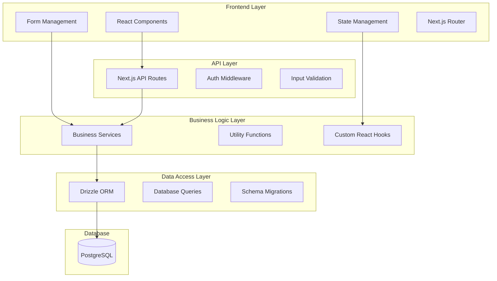

# Design Document

## Overview

The tender management CRUD system will be implemented as a comprehensive web application with a modern, responsive interface built on Next.js with TypeScript. The system follows a layered architecture pattern with clear separation between presentation, business logic, and data access layers. Each phase will be production-ready upon completion, allowing immediate deployment and user adoption.

The implementation strategy prioritizes foundational components first (client management), then builds core tender functionality, and finally adds advanced features like analytics and integrations. This approach ensures users can begin benefiting from the system immediately while we continue development.

## Architecture

### System Architecture Overview



### Technology Stack

- **Frontend**: Next.js 14+ with App Router, React 18+, TypeScript
- **Styling**: Tailwind CSS with shadcn/ui components
- **Forms**: React Hook Form with Zod validation
- **Database**: PostgreSQL with Drizzle ORM
- **Authentication**: Existing auth system integration
- **State Management**: React Query for server state, Zustand for client state
- **File Handling**: Next.js built-in file upload with cloud storage integration

## Components and Interfaces

### Phase 1: Client Management Foundation

#### Core Components (MVP)

- `ClientList` - Paginated, searchable client listing
- `ClientForm` - Create/edit client with embedded primary contact
- `ClientDetails` - Simple client view with primary contact information

#### API Endpoints

```typescript
// Client CRUD
GET / api / clients; // List clients with pagination/search
POST / api / clients; // Create new client
GET / api / clients / [id]; // Get client details
PUT / api / clients / [id]; // Update client
DELETE / api / clients / [id]; // Soft delete client

// Client Contacts
GET / api / clients / [id] / contacts; // List client contacts
POST / api / clients / [id] / contacts; // Add contact
PUT / api / clients / [id] / contacts / [contactId]; // Update contact
DELETE / api / clients / [id] / contacts / [contactId]; // Delete contact

// Client Addresses
GET / api / clients / [id] / addresses; // List client addresses
POST / api / clients / [id] / addresses; // Add address
PUT / api / clients / [id] / addresses / [addressId]; // Update address
DELETE / api / clients / [id] / addresses / [addressId]; // Delete address
```

### Phase 2: Core Tender Management

#### Core Components

- `TenderList` - Advanced tender listing with filters
- `TenderForm` - Comprehensive tender creation/editing
- `TenderDetails` - Full tender view with related data
- `TenderStatusManager` - Status workflow management
- `TenderSearch` - Advanced search and filtering

#### API Endpoints

```typescript
// Tender CRUD
GET    /api/tenders             // List tenders with advanced filtering
POST   /api/tenders             // Create new tender
GET    /api/tenders/[id]        // Get tender details with relations
PUT    /api/tenders/[id]        // Update tender
DELETE /api/tenders/[id]        // Soft delete tender

// Tender Operations
POST   /api/tenders/[id]/status // Update tender status
GET    /api/tenders/search      // Advanced search endpoint
POST   /api/tenders/export      // Export tender data
```

### Phase 3: Follow-up Management

#### Core Components

- `FollowUpList` - Timeline view of follow-ups
- `FollowUpForm` - Create/edit follow-up records
- `CommunicationLog` - Rich text communication tracking
- `FollowUpCalendar` - Calendar integration for scheduling
- `NotificationCenter` - Follow-up reminders and alerts

#### API Endpoints

```typescript
// Follow-up CRUD
GET / api / tenders / [id] / followups; // List tender follow-ups
POST / api / tenders / [id] / followups; // Create follow-up
PUT / api / followups / [id]; // Update follow-up
DELETE / api / followups / [id]; // Delete follow-up

// Follow-up Operations
POST / api / followups / [id] / communications; // Add communication log
GET / api / followups / upcoming; // Get upcoming follow-ups
POST / api / followups / [id] / notifications; // Send notifications
```

### Phase 4: Contract Management

#### Core Components

- `ContractList` - Contract overview and management
- `ContractForm` - Contract creation from tenders
- `ContractDetails` - Contract lifecycle tracking
- `ProjectConverter` - Convert contracts to projects
- `ContractReports` - Contract analytics and reporting

#### API Endpoints

```typescript
// Contract CRUD
GET / api / contracts; // List contracts
POST / api / contracts; // Create contract from tender
GET / api / contracts / [id]; // Get contract details
PUT / api / contracts / [id]; // Update contract
DELETE / api / contracts / [id]; // Soft delete contract

// Contract Operations
POST / api / contracts / [id] / convert - to - project; // Convert to project
GET / api / contracts / reports; // Contract reporting data
```

## Data Models

### Enhanced Data Models with Validation

```typescript
// Client Management (MVP)
interface ClientCreateInput {
  name: string;
  notes?: string;
  // Primary contact information (embedded)
  primaryContactName?: string;
  primaryContactEmail?: string;
  primaryContactPhone?: string;
  primaryContactPosition?: string;
}

// Tender Management (MVP)
interface TenderCreateInput {
  tenderNumber: string; // User-input unique identifier (validated for uniqueness)
  description?: string;
  clientId: string;
  submissionDate?: Date;
  value?: string;
  status: 'draft' | 'submitted' | 'won' | 'lost' | 'pending';
}

// Project Management (MVP)
interface ProjectCreateInput {
  projectNumber: string; // Inherited from tender number or custom
  description?: string; // Inherited from tender description or custom
  tenderId?: string; // Optional link to originating tender
  clientId?: string; // Inherited from tender or custom
  status: 'active' | 'completed' | 'cancelled';
}

// Purchase Order Management (MVP)
interface PurchaseOrderCreateInput {
  projectId: string;
  supplierName: string; // Defaults to organization name
  description: string;
  totalAmount: string;
  status: 'draft' | 'sent' | 'delivered';
  notes?: string;
}

// Follow-up Management (MVP)
interface FollowUpCreateInput {
  tenderId: string;
  notes: string;
  contactPerson?: string;
  nextFollowUpDate?: Date;
}
```

## Error Handling

### Comprehensive Error Management Strategy

```typescript
// Error Types
interface APIError {
  code: string;
  message: string;
  details?: Record<string, any>;
  timestamp: Date;
}

// Error Categories
enum ErrorCodes {
  VALIDATION_ERROR = 'VALIDATION_ERROR',
  NOT_FOUND = 'NOT_FOUND',
  UNAUTHORIZED = 'UNAUTHORIZED',
  CONFLICT = 'CONFLICT',
  INTERNAL_ERROR = 'INTERNAL_ERROR',
  RATE_LIMIT = 'RATE_LIMIT',
}

// Error Handling Middleware
const errorHandler = (error: Error, req: Request, res: Response) => {
  // Log error for monitoring
  // Return user-friendly error response
  // Maintain security by not exposing internal details
};
```

### User Experience Error Handling

- Form validation with real-time feedback
- Optimistic updates with rollback on failure
- Retry mechanisms for network failures
- Graceful degradation for offline scenarios
- Clear error messages with suggested actions

## Testing Strategy

### Multi-Layer Testing Approach

#### Unit Testing

- **Components**: React Testing Library for UI components
- **Services**: Jest for business logic and utility functions
- **API Routes**: Supertest for endpoint testing
- **Database**: In-memory database for query testing

#### Integration Testing

- **API Integration**: Full request/response cycle testing
- **Database Integration**: Real database operations with test data
- **Authentication Flow**: Complete auth integration testing

#### End-to-End Testing

- **User Workflows**: Playwright for complete user journeys
- **Cross-browser Testing**: Chrome, Firefox, Safari compatibility
- **Mobile Responsiveness**: Touch and mobile-specific interactions

#### Performance Testing

- **Load Testing**: API endpoint performance under load
- **Database Performance**: Query optimization and indexing validation
- **Frontend Performance**: Bundle size and rendering performance

### Testing Data Management

- **Test Fixtures**: Comprehensive test data sets for all entities
- **Database Seeding**: Automated test data generation
- **Cleanup Strategies**: Proper test isolation and cleanup
- **Mock Services**: External service mocking for reliable tests

## Implementation Phases

### Phase 1: Database Schema Updates (Week 1)

**Production Ready Deliverables:**

- Safe database migrations for all MVP features
- Updated client table with primary contact fields
- Updated tender table with tender number as primary identifier
- Updated project table with project number and description fields
- Updated purchase order table with supplier name defaulting logic
- All existing data preserved and functionality maintained

**Technical Implementation:**

- Database migrations with rollback capability
- Schema validation and constraint updates
- Data migration scripts for existing records
- Database indexing for new fields
- Comprehensive testing of schema changes

### Phase 2: Core Tender Management (Week 3-4)

**Production Ready Deliverables:**

- Full tender lifecycle management
- Tender status workflow with history tracking
- Advanced search and filtering
- Tender-client relationship management
- Bulk operations (export, status updates)
- Dashboard with basic tender metrics

**Technical Implementation:**

- Tender CRUD API endpoints
- Status workflow management
- Advanced search with indexing
- Bulk operation handling
- Basic analytics queries

### Phase 3: Follow-up Management (Week 5-6)

**Production Ready Deliverables:**

- Complete follow-up tracking system
- Communication log management
- Automated reminder system
- Calendar integration for scheduling
- Notification preferences management
- Follow-up reporting and analytics

**Technical Implementation:**

- Follow-up CRUD operations
- Notification system with email/SMS
- Calendar API integration
- Background job processing for reminders
- Rich text editor for communication logs

### Phase 4: Contract Management (Week 7-8)

**Production Ready Deliverables:**

- Contract creation from successful tenders
- Contract lifecycle tracking
- Document management system
- Project conversion functionality
- Contract reporting and analytics
- Renewal reminder system

**Technical Implementation:**

- Contract CRUD operations
- File upload and document management
- Project conversion logic
- Advanced reporting queries
- Automated renewal notifications

### Phase 5: Dashboard and Analytics (Week 9-10)

**Production Ready Deliverables:**

- Comprehensive tender dashboard
- Advanced analytics and reporting
- Customizable report generation
- Data visualization with charts
- Performance metrics tracking
- Executive summary reports

**Technical Implementation:**

- Analytics data aggregation
- Chart.js/D3.js integration
- Report generation system
- Data export in multiple formats
- Performance monitoring

### Phase 6: Integration and Advanced Features (Week 11-12)

**Production Ready Deliverables:**

- Data import/export functionality
- Calendar system integration
- Advanced notification system
- Audit trail and logging
- Performance optimization
- Mobile app support

**Technical Implementation:**

- Import/export processing
- External API integrations
- Comprehensive logging system
- Performance optimization
- Progressive Web App features

## Security Considerations

### Data Protection

- Role-based access control for all operations
- Organization-level data isolation
- Soft deletion with audit trails
- Encrypted sensitive data storage
- GDPR compliance for data handling

### API Security

- Authentication middleware on all endpoints
- Input validation and sanitization
- Rate limiting to prevent abuse
- SQL injection prevention through ORM
- XSS protection in all user inputs

### File Security

- File type validation and scanning
- Secure file storage with access controls
- Virus scanning for uploaded files
- File size limits and quota management

This design provides a solid foundation for implementing production-ready tender management CRUD functionality in phases, ensuring each phase delivers immediate value while building toward a comprehensive system.
