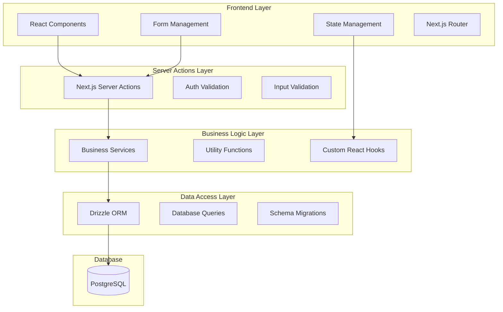

# Design Document

## Overview

The tender management CRUD system will be implemented as a comprehensive web application with a modern, responsive interface built on Next.js with TypeScript. The system follows a layered architecture pattern with clear separation between presentation, business logic, and data access layers. Each phase will be production-ready upon completion, allowing immediate deployment and user adoption.

The implementation strategy prioritizes foundational components first (client management), then builds core tender functionality, and finally adds advanced features like analytics and integrations. This approach ensures users can begin benefiting from the system immediately while we continue development.

## Architecture

### System Architecture Overview



### Technology Stack

- **Frontend**: Next.js 14+ with App Router, React 18+, TypeScript
- **Server Actions**: Next.js Server Actions for data mutations
- **Styling**: Tailwind CSS with shadcn/ui components
- **Forms**: React Hook Form with Zod validation
- **Database**: PostgreSQL with Drizzle ORM
- **Authentication**: Existing auth system integration
- **State Management**: React Query for server state, Zustand for client state
- **File Handling**: Next.js built-in file upload with cloud storage integration

## Components and Interfaces

### Phase 2: Client Management Foundation

#### Core Components (MVP)

- `ClientList` - Paginated, searchable client listing
- `ClientForm` - Create/edit client with embedded contact
- `ClientDetails` - Simple client view with contact information

#### Server Actions

```typescript
// Client CRUD Server Actions
async function getClients(
  organizationId: string,
  search?: string,
  page?: number
);
async function createClient(organizationId: string, data: ClientCreateInput);
async function getClientById(organizationId: string, clientId: string);
async function updateClient(
  organizationId: string,
  clientId: string,
  data: Partial<ClientCreateInput>
);
async function deleteClient(organizationId: string, clientId: string); // Soft delete
```

### Phase 3: Core Tender Management

#### Core Components

- `TenderList` - Advanced tender listing with filters
- `TenderForm` - Comprehensive tender creation/editing
- `TenderDetails` - Full tender view with related data
- `TenderStatusManager` - Status workflow management
- `TenderSearch` - Advanced search and filtering

#### Server Actions

```typescript
// Tender CRUD Server Actions
async function getTenders(organizationId: string, filters?: TenderFilters);
async function createTender(organizationId: string, data: TenderCreateInput);
async function getTenderById(organizationId: string, tenderId: string);
async function updateTender(
  organizationId: string,
  tenderId: string,
  data: Partial<TenderCreateInput>
);
async function deleteTender(organizationId: string, tenderId: string); // Soft delete

// Tender Operations
async function updateTenderStatus(
  organizationId: string,
  tenderId: string,
  status: TenderStatus
);
async function searchTenders(organizationId: string, query: string);
async function exportTenderData(
  organizationId: string,
  filters?: TenderFilters
);
```

### Phase 4: Follow-up Management

#### Core Components

- `FollowUpList` - Timeline view of follow-ups
- `FollowUpForm` - Create/edit follow-up records
- `FollowUpDetails` - Follow-up detail view with notes

#### Server Actions

```typescript
// Follow-up CRUD Server Actions
async function getFollowUps(organizationId: string, tenderId: string);
async function createFollowUp(
  organizationId: string,
  data: FollowUpCreateInput
);
async function updateFollowUp(
  organizationId: string,
  followUpId: string,
  data: Partial<FollowUpCreateInput>
);
async function deleteFollowUp(organizationId: string, followUpId: string); // Soft delete

// Follow-up Operations
async function getUpcomingFollowUps(organizationId: string);
async function searchFollowUps(organizationId: string, query: string);
```

### Phase 5: Project Management

#### Core Components

- `ProjectList` - Project overview and management
- `ProjectForm` - Project creation from tenders
- `ProjectDetails` - Project lifecycle tracking
- `TenderToProjectConverter` - Convert tenders to projects

#### Server Actions

```typescript
// Project CRUD Server Actions
async function getProjects(organizationId: string, filters?: ProjectFilters);
async function createProject(organizationId: string, data: ProjectCreateInput);
async function createProjectFromTender(
  organizationId: string,
  tenderId: string
);
async function getProjectById(organizationId: string, projectId: string);
async function updateProject(
  organizationId: string,
  projectId: string,
  data: Partial<ProjectCreateInput>
);
async function deleteProject(organizationId: string, projectId: string); // Soft delete
```

### Phase 6: Purchase Order Management

#### Core Components

- `PurchaseOrderList` - Purchase order overview and management
- `PurchaseOrderForm` - Purchase order creation for projects
- `PurchaseOrderDetails` - Purchase order lifecycle tracking

#### Server Actions

```typescript
// Purchase Order CRUD Server Actions
async function getPurchaseOrders(organizationId: string, projectId?: string);
async function createPurchaseOrder(
  organizationId: string,
  data: PurchaseOrderCreateInput
);
async function getPurchaseOrderById(organizationId: string, poId: string);
async function updatePurchaseOrder(
  organizationId: string,
  poId: string,
  data: Partial<PurchaseOrderCreateInput>
);
async function deletePurchaseOrder(organizationId: string, poId: string); // Soft delete

// Purchase Order Operations
async function updatePurchaseOrderStatus(
  organizationId: string,
  poId: string,
  status: PurchaseOrderStatus
);
async function getProjectPurchaseOrders(
  organizationId: string,
  projectId: string
);
```

## Data Models

### Enhanced Data Models with Validation

```typescript
// Database Table Definitions (5 New Tables)

// 1. Client Table
export const client = pgTable('client', {
  id: text('id').primaryKey(),
  organizationId: text('organization_id')
    .notNull()
    .references(() => organization.id, { onDelete: 'cascade' }),
  name: text('name').notNull(),
  notes: text('notes'),
  contactName: text('contact_name'),
  contactEmail: text('contact_email'),
  contactPhone: text('contact_phone'),
  createdAt: timestamp('created_at').defaultNow().notNull(),
  updatedAt: timestamp('updated_at').defaultNow().notNull(),
  deletedAt: timestamp('deleted_at'),
});

// 2. Tender Table
export const tender = pgTable('tender', {
  id: text('id').primaryKey(),
  organizationId: text('organization_id')
    .notNull()
    .references(() => organization.id, { onDelete: 'cascade' }),
  tenderNumber: text('tender_number').notNull().unique(),
  description: text('description'),
  clientId: text('client_id')
    .notNull()
    .references(() => client.id, { onDelete: 'cascade' }),
  submissionDate: timestamp('submission_date'),
  value: text('value'),
  status: text('status').default('draft').notNull(),
  createdAt: timestamp('created_at').defaultNow().notNull(),
  updatedAt: timestamp('updated_at').defaultNow().notNull(),
  deletedAt: timestamp('deleted_at'),
});

// 3. Project Table
export const project = pgTable('project', {
  id: text('id').primaryKey(),
  organizationId: text('organization_id')
    .notNull()
    .references(() => organization.id, { onDelete: 'cascade' }),
  projectNumber: text('project_number').notNull(),
  description: text('description'),
  tenderId: text('tender_id').references(() => tender.id),
  clientId: text('client_id').references(() => client.id),
  status: text('status').default('active').notNull(),
  createdAt: timestamp('created_at').defaultNow().notNull(),
  updatedAt: timestamp('updated_at').defaultNow().notNull(),
  deletedAt: timestamp('deleted_at'),
});

// 4. Purchase Order Table
export const purchaseOrder = pgTable('purchase_order', {
  id: text('id').primaryKey(),
  organizationId: text('organization_id')
    .notNull()
    .references(() => organization.id, { onDelete: 'cascade' }),
  projectId: text('project_id')
    .notNull()
    .references(() => project.id, { onDelete: 'cascade' }),
  supplierName: text('supplier_name').notNull(),
  description: text('description').notNull(),
  totalAmount: text('total_amount').notNull(),
  status: text('status').default('draft').notNull(),
  notes: text('notes'),
  createdAt: timestamp('created_at').defaultNow().notNull(),
  updatedAt: timestamp('updated_at').defaultNow().notNull(),
  deletedAt: timestamp('deleted_at'),
});

// 5. Follow-up Table
export const followUp = pgTable('follow_up', {
  id: text('id').primaryKey(),
  organizationId: text('organization_id')
    .notNull()
    .references(() => organization.id, { onDelete: 'cascade' }),
  tenderId: text('tender_id')
    .notNull()
    .references(() => tender.id, { onDelete: 'cascade' }),
  notes: text('notes').notNull(),
  contactPerson: text('contact_person'),
  nextFollowUpDate: timestamp('next_follow_up_date'),
  createdBy: text('created_by')
    .notNull()
    .references(() => user.id, { onDelete: 'cascade' }),
  createdAt: timestamp('created_at').defaultNow().notNull(),
  updatedAt: timestamp('updated_at').defaultNow().notNull(),
  deletedAt: timestamp('deleted_at'),
});

// Input Interfaces
interface ClientCreateInput {
  name: string;
  notes?: string;
  contactName?: string;
  contactEmail?: string;
  contactPhone?: string;
}

// Tender Management (MVP)
interface TenderCreateInput {
  tenderNumber: string; // User-input unique identifier (validated for uniqueness)
  description?: string;
  clientId: string;
  submissionDate?: Date;
  value?: string;
  status: 'draft' | 'submitted' | 'won' | 'lost' | 'pending';
}

// Project Management (MVP)
interface ProjectCreateInput {
  projectNumber: string; // Inherited from tender number or custom
  description?: string; // Inherited from tender description or custom
  tenderId?: string; // Optional link to originating tender
  clientId?: string; // Inherited from tender or custom
  status: 'active' | 'completed' | 'cancelled';
}

// Purchase Order Management (MVP)
interface PurchaseOrderCreateInput {
  projectId: string;
  supplierName: string; // Defaults to organization name
  description: string;
  totalAmount: string;
  status: 'draft' | 'sent' | 'delivered';
  notes?: string;
}

// Follow-up Management (MVP)
interface FollowUpCreateInput {
  tenderId: string;
  notes: string;
  contactPerson?: string;
  nextFollowUpDate?: Date;
}
```

## Error Handling

### Comprehensive Error Management Strategy

```typescript
// Error Types
interface APIError {
  code: string;
  message: string;
  details?: Record<string, any>;
  timestamp: Date;
}

// Error Categories
enum ErrorCodes {
  VALIDATION_ERROR = 'VALIDATION_ERROR',
  NOT_FOUND = 'NOT_FOUND',
  UNAUTHORIZED = 'UNAUTHORIZED',
  CONFLICT = 'CONFLICT',
  INTERNAL_ERROR = 'INTERNAL_ERROR',
  RATE_LIMIT = 'RATE_LIMIT',
}

// Error Handling Middleware
const errorHandler = (error: Error, req: Request, res: Response) => {
  // Log error for monitoring
  // Return user-friendly error response
  // Maintain security by not exposing internal details
};
```

### User Experience Error Handling

- Form validation with real-time feedback
- Optimistic updates with rollback on failure
- Retry mechanisms for network failures
- Graceful degradation for offline scenarios
- Clear error messages with suggested actions

## Testing Strategy

### Multi-Layer Testing Approach

#### Unit Testing

- **Components**: React Testing Library for UI components
- **Services**: Jest for business logic and utility functions
- **API Routes**: Supertest for endpoint testing
- **Database**: In-memory database for query testing

#### Integration Testing

- **API Integration**: Full request/response cycle testing
- **Database Integration**: Real database operations with test data
- **Authentication Flow**: Complete auth integration testing

#### End-to-End Testing

- **User Workflows**: Playwright for complete user journeys
- **Cross-browser Testing**: Chrome, Firefox, Safari compatibility
- **Mobile Responsiveness**: Touch and mobile-specific interactions

#### Performance Testing

- **Load Testing**: API endpoint performance under load
- **Database Performance**: Query optimization and indexing validation
- **Frontend Performance**: Bundle size and rendering performance

### Testing Data Management

- **Test Fixtures**: Comprehensive test data sets for all entities
- **Database Seeding**: Automated test data generation
- **Cleanup Strategies**: Proper test isolation and cleanup
- **Mock Services**: External service mocking for reliable tests

## Implementation Phases

### Phase 1: Database Schema Creation

**Production Ready Deliverables:**

- 5 new database tables created (client, tender, project, purchaseOrder, followUp)
- Proper foreign key relationships and organization isolation
- Soft deletion support across all tables
- Database indexes for search optimization
- All existing tables remain unchanged

**Technical Implementation:**

- Database migrations with rollback capability
- Schema validation and constraint creation
- Database indexing for new fields
- Comprehensive testing of schema changes

### Phase 2: Client Management Foundation

**Production Ready Deliverables:**

- Complete client CRUD functionality with server actions
- Embedded contact information management
- Client search and filtering capabilities
- Organization-scoped client management
- Responsive client management UI

**Technical Implementation:**

- Client server actions with validation
- Client UI components and pages
- Search and pagination functionality
- Form validation and error handling

### Phase 3: Core Tender Management

**Production Ready Deliverables:**

- Full tender lifecycle management with unique tender numbers
- Tender status workflow with history tracking
- Advanced search and filtering by tender number
- Tender-client relationship management
- Responsive tender management UI

**Technical Implementation:**

- Tender server actions with number validation
- Tender UI components and workflows
- Status workflow management
- Advanced search with indexing

### Phase 4: Follow-up Management

**Production Ready Deliverables:**

- Complete follow-up tracking system for tenders
- Chronological follow-up display and management
- User attribution and timestamp tracking
- Follow-up search and filtering
- Responsive follow-up management UI

**Technical Implementation:**

- Follow-up server actions with tender relationships
- Follow-up UI components and pages
- Timeline view and chronological sorting
- User attribution and organization isolation

### Phase 5: Project Management

**Production Ready Deliverables:**

- Project creation from won tenders with inheritance
- Standalone project creation and management
- Project number and description inheritance logic
- Project-tender relationship tracking
- Responsive project management UI

**Technical Implementation:**

- Project server actions with inheritance logic
- Tender-to-project conversion functionality
- Project UI components and workflows
- Inheritance validation and management

### Phase 6: Purchase Order Management

**Production Ready Deliverables:**

- Purchase order creation and management for projects
- Supplier name defaulting to organization name
- Purchase order status workflow tracking
- Project-based purchase order organization
- Responsive purchase order management UI

**Technical Implementation:**

- Purchase order server actions with project relationships
- Supplier name defaulting and override logic
- Purchase order UI components and workflows
- Project-based organization and filtering

## Security Considerations

### Data Protection

- Role-based access control for all operations
- Organization-level data isolation
- Soft deletion with audit trails
- Encrypted sensitive data storage
- GDPR compliance for data handling

### API Security

- Authentication middleware on all endpoints
- Input validation and sanitization
- Rate limiting to prevent abuse
- SQL injection prevention through ORM
- XSS protection in all user inputs

### File Security

- File type validation and scanning
- Secure file storage with access controls
- Virus scanning for uploaded files
- File size limits and quota management

This design provides a solid foundation for implementing production-ready tender management CRUD functionality in phases, ensuring each phase delivers immediate value while building toward a comprehensive system.
