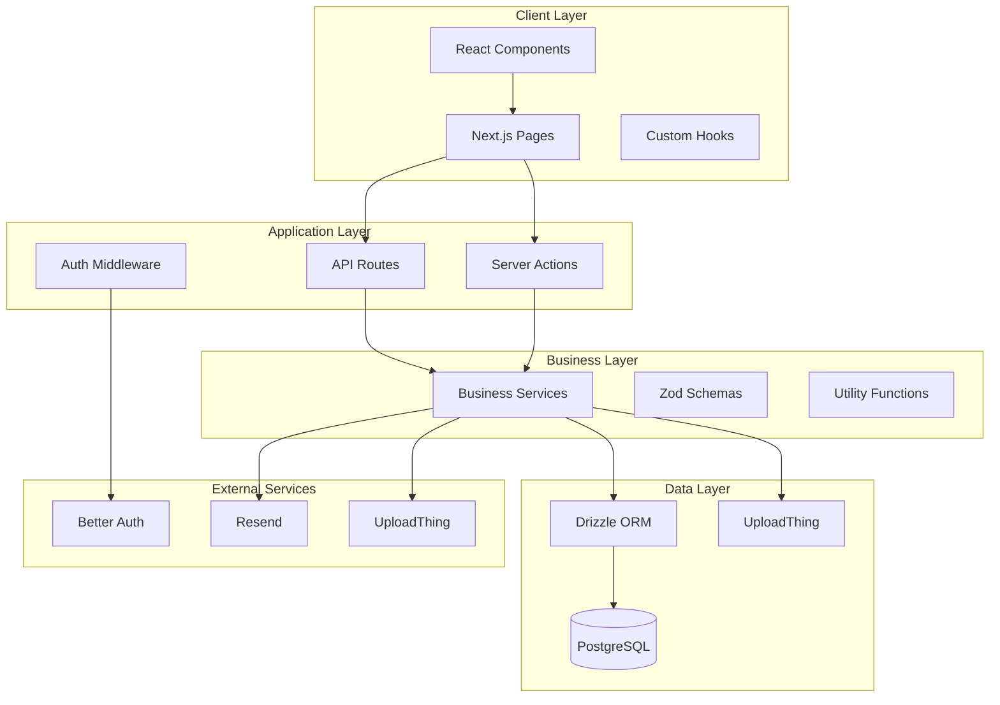

# Tender Track 360 - Main Application Design

## Overview

Tender Track 360 is a modern, full-stack web application built with Next.js 15, featuring organization-based multi-tenancy, comprehensive tender lifecycle management, and advanced collaboration tools. The system uses a clean architecture pattern with clear separation between presentation, business logic, and data layers, ensuring maintainability and scalability.

## Architecture

### High-Level Architecture



### Technology Stack

- **Frontend**: Next.js 15, React 19, TypeScript, Tailwind CSS
- **Backend**: Next.js Server Actions, API Routes
- **Database**: PostgreSQL with Drizzle ORM
- **Authentication**: Better Auth with session management
- **File Storage**: UploadThing for document management
- **Email**: Resend for notifications
- **UI Components**: Radix UI with custom design system
- **Validation**: Zod for type-safe validation
- **Testing**: Jest with React Testing Library

## Components and Interfaces

### Core Domain Models

```typescript
// Tender Management
interface Tender {
  id: string;
  organizationId: string;
  referenceNumber: string;
  title: string;
  issuingAuthority: string;
  category: TenderCategory;
  status: TenderStatus;
  estimatedValue?: number;
  closingDate: Date;
  submissionDate?: Date;
  outcomeDate?: Date;
  outcomeNotes?: string;
  createdBy: string;
  assignedUsers: string[];
  createdAt: Date;
  updatedAt: Date;
}

// Document Management
interface Document {
  id: string;
  tenderId: string;
  organizationId: string;
  name: string;
  category: DocumentCategory;
  uploadThingUrl: string;
  uploadThingKey: string;
  version: number;
  parentDocumentId?: string;
  uploadedBy: string;
  permissions: DocumentPermission[];
  createdAt: Date;
  updatedAt: Date;
}

// Team Collaboration
interface Task {
  id: string;
  tenderId: string;
  organizationId: string;
  title: string;
  description?: string;
  assignedTo?: string;
  status: TaskStatus;
  priority: TaskPriority;
  dueDate?: Date;
  completedAt?: Date;
  createdBy: string;
  createdAt: Date;
  updatedAt: Date;
}

// Audit Trail
interface AuditLog {
  id: string;
  organizationId: string;
  entityType: string;
  entityId: string;
  action: AuditAction;
  changes: Record<string, any>;
  userId: string;
  ipAddress?: string;
  userAgent?: string;
  createdAt: Date;
}
```

### Service Layer Architecture

```typescript
// Base Service Pattern
abstract class BaseService {
  protected db: DrizzleDB;
  protected organizationId: string;

  constructor(db: DrizzleDB, organizationId: string) {
    this.db = db;
    this.organizationId = organizationId;
  }

  protected enforceOrganizationAccess(entityOrgId: string): void {
    if (entityOrgId !== this.organizationId) {
      throw new UnauthorizedError('Access denied');
    }
  }
}

// Tender Service
class TenderService extends BaseService {
  async createTender(data: CreateTenderInput): Promise<Tender>;
  async updateTender(id: string, data: UpdateTenderInput): Promise<Tender>;
  async getTender(id: string): Promise<Tender>;
  async listTenders(filters: TenderFilters): Promise<PaginatedResult<Tender>>;
  async deleteTender(id: string): Promise<void>;
  async assignUsers(tenderId: string, userIds: string[]): Promise<void>;
  async updateStatus(tenderId: string, status: TenderStatus): Promise<void>;
}

// Document Service
class DocumentService extends BaseService {
  async uploadDocument(data: UploadDocumentInput): Promise<Document>;
  async getDocument(id: string): Promise<Document>;
  async listDocuments(tenderId: string): Promise<Document[]>;
  async deleteDocument(id: string): Promise<void>;
  async createVersion(
    documentId: string,
    data: VersionInput
  ): Promise<Document>;
  async updatePermissions(
    documentId: string,
    permissions: DocumentPermission[]
  ): Promise<void>;
}

// Analytics Service
class AnalyticsService extends BaseService {
  async getTenderOverview(): Promise<TenderOverview>;
  async getSuccessRates(period: DateRange): Promise<SuccessRateMetrics>;
  async getFinancialMetrics(period: DateRange): Promise<FinancialMetrics>;
  async getTeamPerformance(): Promise<TeamPerformanceMetrics>;
}
```

### Authentication & Authorization

```typescript
// Role-based Access Control
enum UserRole {
  OWNER = 'owner',
  ADMIN = 'admin',
  TENDER_MANAGER = 'tender_manager',
  TENDER_SPECIALIST = 'tender_specialist',
  VIEWER = 'viewer',
}

// Permission System
interface Permission {
  resource: string;
  action: string;
  conditions?: Record<string, any>;
}

class AuthorizationService {
  static getRolePermissions(role: UserRole): Permission[] {
    // Define role-based permissions
  }

  static canAccess(
    userRole: UserRole,
    resource: string,
    action: string
  ): boolean {
    // Check if user can perform action on resource
  }

  static canAccessTender(
    userRole: UserRole,
    tender: Tender,
    userId: string
  ): boolean {
    // Check tender-specific access
  }
}
```

## Data Models

### Database Schema Design

```sql
-- Core Tables
CREATE TABLE organizations (
  id TEXT PRIMARY KEY,
  name TEXT NOT NULL,
  slug TEXT UNIQUE,
  logo TEXT,
  settings JSONB DEFAULT '{}',
  created_at TIMESTAMP DEFAULT NOW(),
  updated_at TIMESTAMP DEFAULT NOW()
);

CREATE TABLE tenders (
  id TEXT PRIMARY KEY,
  organization_id TEXT NOT NULL REFERENCES organizations(id) ON DELETE CASCADE,
  reference_number TEXT NOT NULL,
  title TEXT NOT NULL,
  issuing_authority TEXT NOT NULL,
  category tender_category NOT NULL,
  status tender_status NOT NULL DEFAULT 'draft',
  estimated_value DECIMAL(15,2),
  closing_date TIMESTAMP NOT NULL,
  submission_date TIMESTAMP,
  outcome_date TIMESTAMP,
  outcome_notes TEXT,
  created_by TEXT NOT NULL REFERENCES users(id),
  created_at TIMESTAMP DEFAULT NOW(),
  updated_at TIMESTAMP DEFAULT NOW(),
  UNIQUE(organization_id, reference_number)
);

CREATE TABLE documents (
  id TEXT PRIMARY KEY,
  tender_id TEXT NOT NULL REFERENCES tenders(id) ON DELETE CASCADE,
  organization_id TEXT NOT NULL REFERENCES organizations(id) ON DELETE CASCADE,
  name TEXT NOT NULL,
  category document_category NOT NULL,
  uploadthing_url TEXT NOT NULL,
  uploadthing_key TEXT NOT NULL,
  version INTEGER DEFAULT 1,
  parent_document_id TEXT REFERENCES documents(id),
  uploaded_by TEXT NOT NULL REFERENCES users(id),
  created_at TIMESTAMP DEFAULT NOW(),
  updated_at TIMESTAMP DEFAULT NOW()
);

CREATE TABLE tasks (
  id TEXT PRIMARY KEY,
  tender_id TEXT NOT NULL REFERENCES tenders(id) ON DELETE CASCADE,
  organization_id TEXT NOT NULL REFERENCES organizations(id) ON DELETE CASCADE,
  title TEXT NOT NULL,
  description TEXT,
  assigned_to TEXT REFERENCES users(id),
  status task_status NOT NULL DEFAULT 'todo',
  priority task_priority NOT NULL DEFAULT 'medium',
  due_date TIMESTAMP,
  completed_at TIMESTAMP,
  created_by TEXT NOT NULL REFERENCES users(id),
  created_at TIMESTAMP DEFAULT NOW(),
  updated_at TIMESTAMP DEFAULT NOW()
);

CREATE TABLE audit_logs (
  id TEXT PRIMARY KEY,
  organization_id TEXT NOT NULL REFERENCES organizations(id) ON DELETE CASCADE,
  entity_type TEXT NOT NULL,
  entity_id TEXT NOT NULL,
  action audit_action NOT NULL,
  changes JSONB NOT NULL,
  user_id TEXT NOT NULL REFERENCES users(id),
  ip_address INET,
  user_agent TEXT,
  created_at TIMESTAMP DEFAULT NOW()
);
```

### Indexes for Performance

```sql
-- Performance Indexes
CREATE INDEX idx_tenders_organization_status ON tenders(organization_id, status);
CREATE INDEX idx_tenders_closing_date ON tenders(closing_date);
CREATE INDEX idx_tenders_category ON tenders(category);
CREATE INDEX idx_documents_tender_category ON documents(tender_id, category);
CREATE INDEX idx_tasks_assigned_status ON tasks(assigned_to, status);
CREATE INDEX idx_audit_logs_entity ON audit_logs(entity_type, entity_id);
CREATE INDEX idx_audit_logs_organization_date ON audit_logs(organization_id, created_at);
```

## Error Handling

### Error Types and Handling Strategy

```typescript
// Custom Error Classes
class TenderTrackError extends Error {
  constructor(
    message: string,
    public code: string,
    public statusCode: number = 500
  ) {
    super(message);
    this.name = 'TenderTrackError';
  }
}

class ValidationError extends TenderTrackError {
  constructor(
    message: string,
    public field?: string
  ) {
    super(message, 'VALIDATION_ERROR', 400);
  }
}

class UnauthorizedError extends TenderTrackError {
  constructor(message: string = 'Unauthorized access') {
    super(message, 'UNAUTHORIZED', 401);
  }
}

class NotFoundError extends TenderTrackError {
  constructor(resource: string) {
    super(`${resource} not found`, 'NOT_FOUND', 404);
  }
}

// Global Error Handler
class ErrorHandler {
  static handle(error: Error): ErrorResponse {
    if (error instanceof TenderTrackError) {
      return {
        success: false,
        error: {
          code: error.code,
          message: error.message,
          statusCode: error.statusCode,
        },
      };
    }

    // Log unexpected errors
    console.error('Unexpected error:', error);

    return {
      success: false,
      error: {
        code: 'INTERNAL_ERROR',
        message: 'An unexpected error occurred',
        statusCode: 500,
      },
    };
  }
}
```

### Client-Side Error Handling

```typescript
// Error Boundary Component
class TenderTrackErrorBoundary extends React.Component {
  state = { hasError: false, error: null };

  static getDerivedStateFromError(error: Error) {
    return { hasError: true, error };
  }

  componentDidCatch(error: Error, errorInfo: React.ErrorInfo) {
    // Log error to monitoring service
    console.error('React Error Boundary:', error, errorInfo);
  }

  render() {
    if (this.state.hasError) {
      return <ErrorFallback error={this.state.error} />;
    }

    return this.props.children;
  }
}

// API Error Handling Hook
function useApiError() {
  const [error, setError] = useState<ApiError | null>(null);

  const handleError = useCallback((error: unknown) => {
    if (error instanceof ApiError) {
      setError(error);
    } else {
      setError(new ApiError('An unexpected error occurred'));
    }
  }, []);

  const clearError = useCallback(() => setError(null), []);

  return { error, handleError, clearError };
}
```

## Testing Strategy

### Testing Pyramid

```typescript
// Unit Tests - Services and Utilities
describe('TenderService', () => {
  let service: TenderService;
  let mockDb: MockDatabase;

  beforeEach(() => {
    mockDb = createMockDatabase();
    service = new TenderService(mockDb, 'org-123');
  });

  it('should create tender with valid data', async () => {
    const tenderData = createValidTenderData();
    const result = await service.createTender(tenderData);

    expect(result).toMatchObject({
      id: expect.any(String),
      organizationId: 'org-123',
      ...tenderData,
    });
  });

  it('should enforce organization isolation', async () => {
    const otherOrgTender = {
      ...createValidTenderData(),
      organizationId: 'other-org',
    };

    await expect(service.getTender(otherOrgTender.id)).rejects.toThrow(
      UnauthorizedError
    );
  });
});

// Integration Tests - API Routes
describe('/api/tenders', () => {
  it('should create tender via API', async () => {
    const response = await request(app)
      .post('/api/tenders')
      .set('Authorization', `Bearer ${validToken}`)
      .send(validTenderData)
      .expect(201);

    expect(response.body).toMatchObject({
      success: true,
      data: expect.objectContaining({
        id: expect.any(String),
        title: validTenderData.title,
      }),
    });
  });
});

// E2E Tests - User Workflows
describe('Tender Management Workflow', () => {
  it('should allow complete tender lifecycle', async () => {
    // Login
    await page.goto('/login');
    await page.fill('[data-testid=email]', 'user@example.com');
    await page.fill('[data-testid=password]', 'password');
    await page.click('[data-testid=login-button]');

    // Create tender
    await page.goto('/tenders/new');
    await page.fill('[data-testid=title]', 'Test Tender');
    await page.click('[data-testid=submit]');

    // Verify creation
    await expect(page.locator('[data-testid=tender-title]')).toHaveText(
      'Test Tender'
    );
  });
});
```

### Performance Testing

```typescript
// Load Testing Configuration
const loadTestConfig = {
  scenarios: {
    tender_creation: {
      executor: 'ramping-vus',
      startVUs: 1,
      stages: [
        { duration: '2m', target: 10 },
        { duration: '5m', target: 50 },
        { duration: '2m', target: 0 },
      ],
    },
  },
  thresholds: {
    http_req_duration: ['p(95)<2000'], // 95% of requests under 2s
    http_req_failed: ['rate<0.1'], // Error rate under 10%
  },
};
```

This design provides a comprehensive foundation for the Tender Track 360 application, ensuring scalability, maintainability, and robust functionality across all core features.
