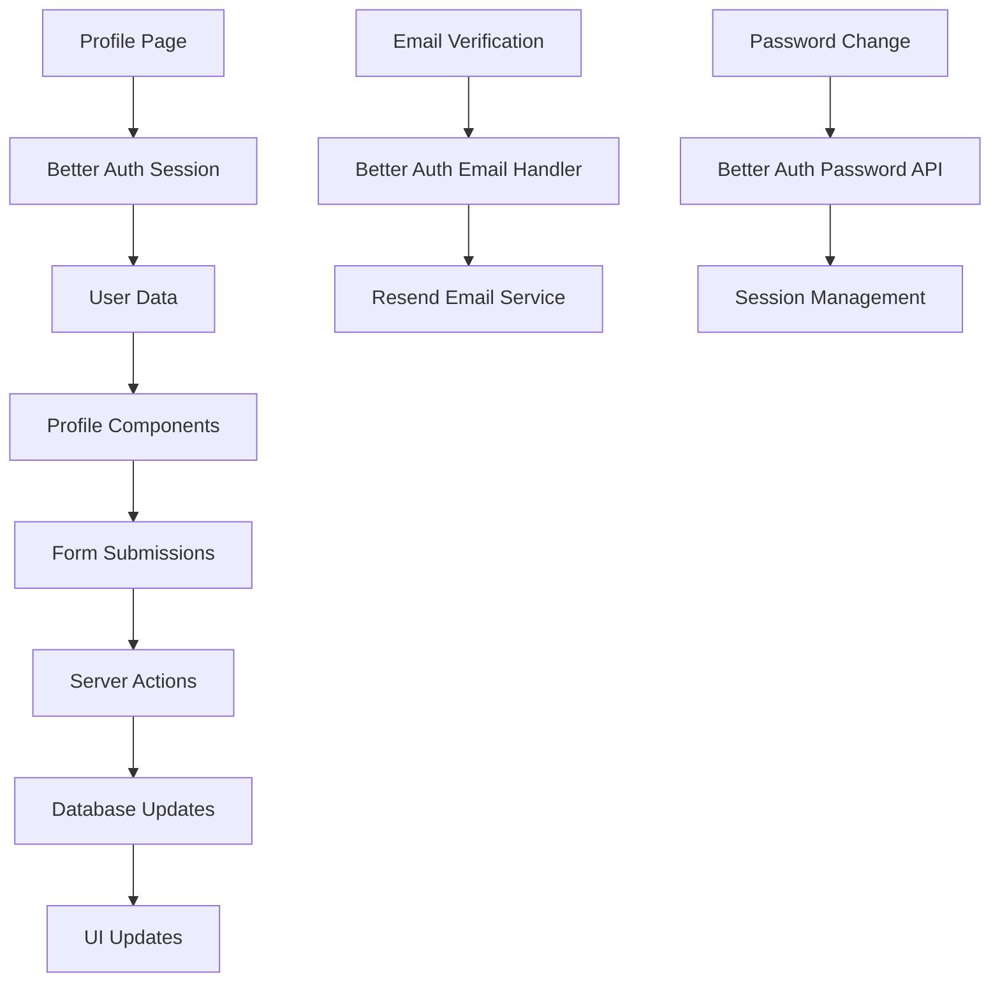

# User Profile Management - Design Document

## Overview

The User Profile Management feature provides a comprehensive interface for users to manage their account information, security settings, and preferences within Tender Track 360. The design leverages the existing Better Auth integration and follows the established UI patterns using the current design system components.

## Architecture

### Component Structure

```
src/app/profile/
├── page.tsx                    # Main profile page layout
├── components/
│   ├── profile-header.tsx      # User avatar and basic info display
│   ├── profile-form.tsx        # Editable profile information form
│   ├── email-settings.tsx      # Email management and verification
│   ├── password-form.tsx       # Password change form
│   ├── organization-info.tsx   # Organization details and role display
│   ├── security-settings.tsx   # Security and session management
│   └── preferences-form.tsx    # User preferences and notifications
└── actions.ts                  # Server actions for profile updates
```

### Data Flow



## Components and Interfaces

### 1. Profile Page Layout (`page.tsx`)

**Purpose**: Main container that orchestrates all profile management sections

**Key Features**:

- Server-side session validation using Better Auth
- Responsive layout with tabbed or sectioned interface
- Loading states and error boundaries
- Breadcrumb navigation

**Implementation**:

```typescript
// Server component with session validation
export default async function ProfilePage() {
  const session = await auth.api.getSession({
    headers: await headers()
  });

  if (!session) {
    redirect('/login');
  }

  return (
    <div className="container mx-auto py-8">
      <ProfileHeader user={session.user} />
      <ProfileTabs user={session.user} />
    </div>
  );
}
```

### 2. Profile Header Component

**Purpose**: Display user avatar, name, and quick status information

**Key Features**:

- User avatar with fallback to initials
- Email verification status indicator
- Organization and role display
- Quick action buttons

**Data Requirements**:

- User name, email, image
- Email verification status
- Organization name and user role
- Account creation date

### 3. Profile Form Component

**Purpose**: Editable form for basic profile information

**Key Features**:

- Form validation using react-hook-form
- Image upload integration (future: UploadThing)
- Real-time validation feedback
- Optimistic UI updates

**Validation Rules**:

- Name: Required, 2-50 characters
- Image: Optional, valid URL or file upload

### 4. Email Settings Component

**Purpose**: Manage email address and verification status

**Key Features**:

- Display current email and verification status
- Resend verification email functionality
- Email change workflow (future enhancement)
- Clear status indicators and messaging

**Integration Points**:

- Better Auth email verification API
- Resend email service for verification emails

### 5. Password Form Component

**Purpose**: Secure password change interface

**Key Features**:

- Current password verification
- New password strength validation
- Confirmation password matching
- Session management options

**Security Considerations**:

- Password strength requirements (8+ chars, mixed case, numbers, symbols)
- Current password verification required
- Option to sign out other sessions after change
- Rate limiting on password change attempts

### 6. Organization Info Component

**Purpose**: Display organization details and user role information

**Key Features**:

- Organization name and details
- User role and permissions explanation
- Join date and status
- Links to organization management (for admins)

**Role-Based Display**:

- Admin: Show organization management links
- Manager: Show team management options
- Specialist/Viewer: Show read-only information

### 7. Security Settings Component

**Purpose**: Account security and session management

**Key Features**:

- Active sessions display
- Login history (last 10 logins)
- Sign out other devices functionality
- Security event log

**Data Display**:

- Session information: device, location, last active
- Login history: timestamp, IP address, device type
- Security events: password changes, email updates

### 8. Preferences Form Component

**Purpose**: User customization and notification settings

**Key Features**:

- Email notification preferences
- Timezone selection
- Dashboard layout preferences
- Theme preferences (future)

**Preference Categories**:

- Notifications: Email alerts, deadline reminders, team updates
- Display: Timezone, date format, dashboard layout
- Privacy: Profile visibility, activity sharing

## Data Models

### Profile Update Interface

```typescript
interface ProfileUpdateData {
  name?: string;
  image?: string;
}

interface EmailUpdateData {
  newEmail: string;
  currentPassword: string;
}

interface PasswordUpdateData {
  currentPassword: string;
  newPassword: string;
  confirmPassword: string;
  signOutOtherSessions?: boolean;
}

interface PreferencesUpdateData {
  emailNotifications: boolean;
  deadlineReminders: boolean;
  teamUpdates: boolean;
  timezone: string;
  dateFormat: string;
  dashboardLayout: 'compact' | 'detailed';
}
```

### Session Information Interface

```typescript
interface SessionInfo {
  id: string;
  device: string;
  location: string;
  ipAddress: string;
  lastActive: Date;
  current: boolean;
}

interface LoginHistoryEntry {
  timestamp: Date;
  ipAddress: string;
  device: string;
  location: string;
  success: boolean;
}
```

## Error Handling

### Client-Side Error Handling

- Form validation errors displayed inline
- Network errors shown with retry options
- Loading states for all async operations
- Toast notifications for success/error feedback

### Server-Side Error Handling

- Input validation on all server actions
- Database constraint error handling
- Authentication error responses
- Rate limiting for sensitive operations

### Error Types and Messages

```typescript
enum ProfileErrorType {
  VALIDATION_ERROR = 'validation_error',
  AUTHENTICATION_ERROR = 'authentication_error',
  PERMISSION_ERROR = 'permission_error',
  NETWORK_ERROR = 'network_error',
  RATE_LIMIT_ERROR = 'rate_limit_error',
}

const ERROR_MESSAGES = {
  [ProfileErrorType.VALIDATION_ERROR]: 'Please check your input and try again',
  [ProfileErrorType.AUTHENTICATION_ERROR]: 'Please sign in to continue',
  [ProfileErrorType.PERMISSION_ERROR]:
    'You do not have permission to perform this action',
  [ProfileErrorType.NETWORK_ERROR]: 'Network error. Please try again',
  [ProfileErrorType.RATE_LIMIT_ERROR]:
    'Too many attempts. Please wait before trying again',
};
```

## Testing Strategy

### Unit Testing

- Component rendering with different user states
- Form validation logic
- Error handling scenarios
- Server action functionality

### Integration Testing

- Better Auth integration
- Email verification flow
- Password change workflow
- Session management

### End-to-End Testing

- Complete profile update workflow
- Email verification process
- Password change and session management
- Cross-browser compatibility

### Test Scenarios

1. **Profile Information Updates**
   - Valid profile updates save successfully
   - Invalid input shows appropriate errors
   - Optimistic updates work correctly

2. **Email Management**
   - Verification email sends successfully
   - Verification status updates correctly
   - Unverified users see appropriate prompts

3. **Password Management**
   - Current password validation works
   - New password meets strength requirements
   - Session management options function correctly

4. **Security Features**
   - Session information displays accurately
   - Sign out other devices works
   - Login history shows correct information

## Performance Considerations

### Optimization Strategies

- Server-side rendering for initial page load
- Client-side caching of user preferences
- Optimistic updates for better UX
- Lazy loading of non-critical components

### Caching Strategy

- Session data cached on client
- User preferences cached locally
- Profile images cached with appropriate headers
- API responses cached where appropriate

### Loading States

- Skeleton loaders for profile sections
- Progressive loading of non-critical data
- Smooth transitions between states
- Error boundaries for graceful degradation

## Security Considerations

### Data Protection

- All sensitive operations require authentication
- Password changes require current password
- Email changes require verification
- Session tokens properly managed

### Input Validation

- Client-side validation for UX
- Server-side validation for security
- SQL injection prevention
- XSS protection on all inputs

### Rate Limiting

- Password change attempts limited
- Email verification requests limited
- Profile update frequency limited
- Session management actions limited

## Accessibility

### WCAG Compliance

- Proper heading hierarchy
- Form labels and descriptions
- Keyboard navigation support
- Screen reader compatibility

### User Experience

- Clear error messages
- Consistent navigation
- Responsive design
- High contrast support

## Future Enhancements

### Phase 1 Extensions

- Profile image upload with UploadThing
- Advanced notification preferences
- Two-factor authentication settings
- Account deletion workflow

### Phase 2 Enhancements

- Social account linking
- Advanced security settings
- Audit log for profile changes
- Export personal data functionality
