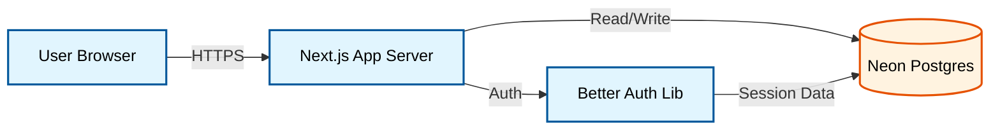
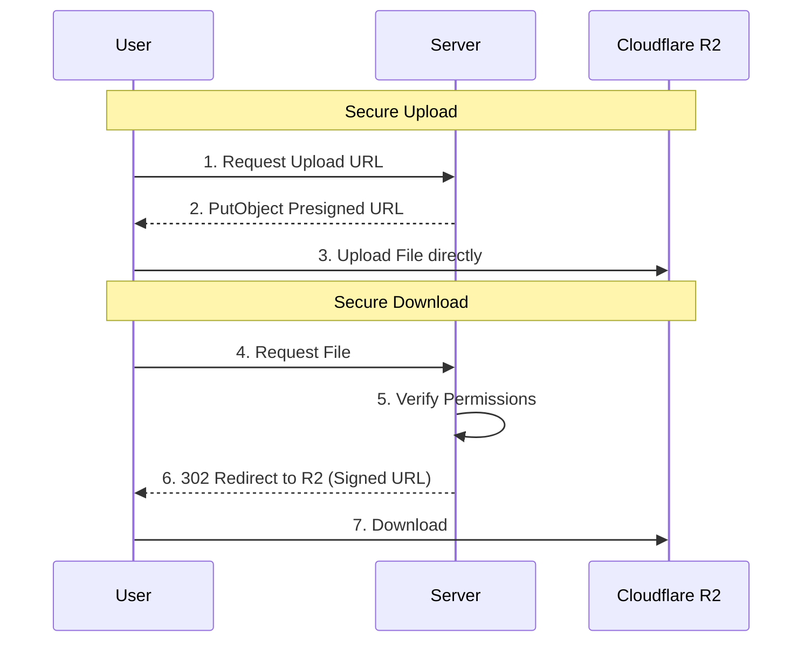
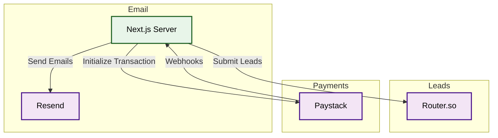
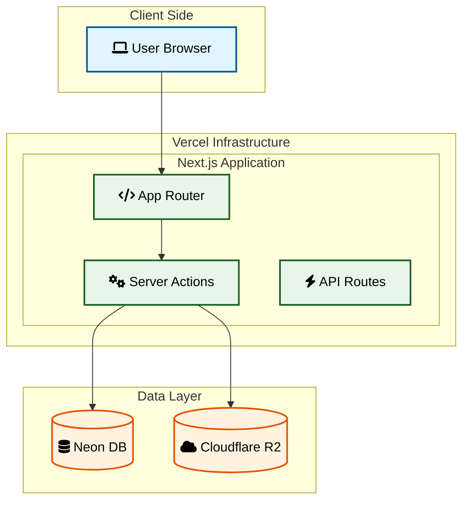

# System Architecture Guide

This guide breaks down the Tender Track 360 architecture into logical components for easier understanding.

## 1. Core Application Flow

The core application runs on Vercel (Next.js) and interacts with Neon (Postgres) for data persistence. Authentication is handled via Better Auth.

## 2. Storage Architecture (R2)

We use a "Split Storage" pattern where metadata lives in Postgres, but the actual files live in Cloudflare R2. We do not stream files through our server; we use Presigned URLs.

## 3. External Integrations

Tender Track 360 relies on several key external services for specialized functionality.

## 4. Full System Overview

For a view of how everything connects together, refer to the master diagram below.

