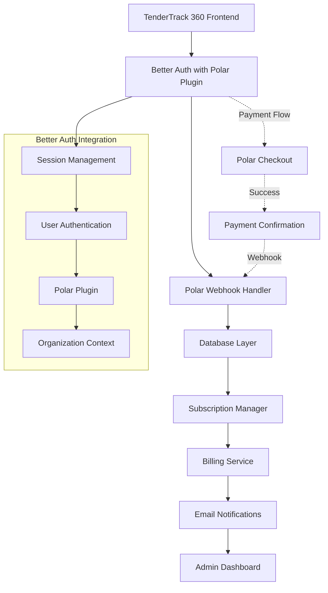
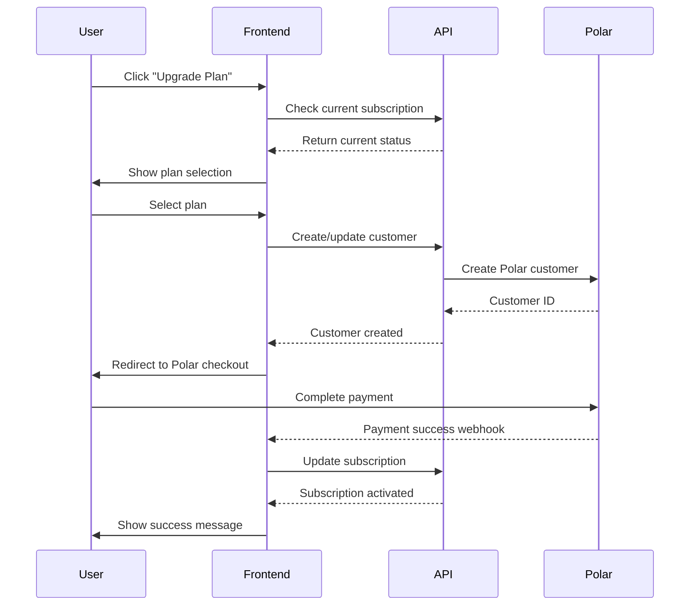
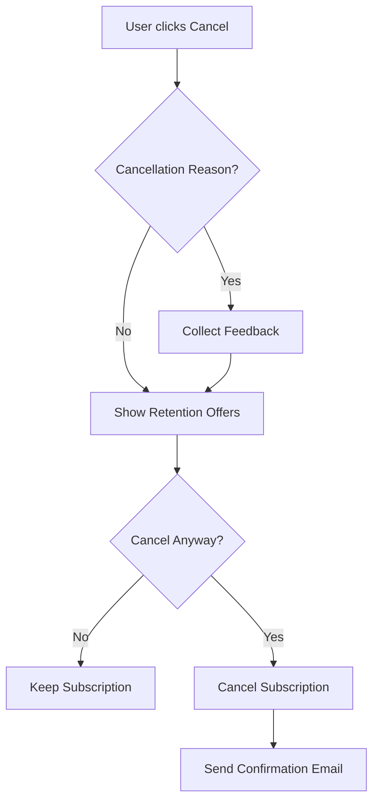
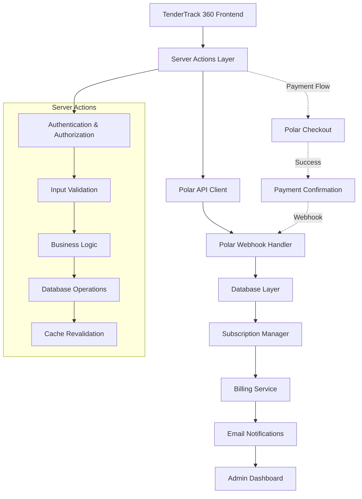

# Polar Payments Integration Plan

## Overview

This document outlines a comprehensive integration plan for Polar payments system into the TenderTrack 360 platform. The integration will enable seamless subscription management, payment processing, and billing functionality for organizations using the platform.

## System Architecture & Components

### Core Components (Updated with Better Auth Integration)



### Architecture Layers (Updated for Better Auth)

1. **Frontend Layer**
    - React components for subscription management
    - Payment method selection UI using Better Auth sessions
    - Billing history and invoice display
    - Upgrade/downgrade flows with organization context

2. **Authentication Layer (Better Auth)**
    - Session management and user authentication
    - Organization context and role-based access
    - Polar plugin integration
    - Automatic user and customer management

3. **API Layer**
    - Better Auth Polar plugin methods
    - Webhook event handlers with session context
    - Subscription state management
    - Payment verification endpoints

4. **Database Layer**
    - Better Auth user and session tables
    - Organization and member tables
    - Subscription records linked to Better Auth users
    - Payment transaction logs with user context

5. **Service Layer**
    - Billing calculation engine with Better Auth context
    - Proration logic using organization data
    - Email notification service with user preferences
    - Analytics and reporting with multi-tenant support

## Better Auth Polar Plugin Integration

### 1. **Updated Dependencies & Configuration**

```typescript
// src/lib/auth.ts (Updated with Polar Plugin)
import { betterAuth } from "better-auth";
import { polar } from "better-auth/plugins/polar";
import { organization } from "better-auth/plugins/organization";
import { drizzleAdapter } from "better-auth/adapters/drizzle";
import { db } from "@/db";
import { schema } from "@/db/schema";

export const auth = betterAuth({
  database: drizzleAdapter(db, {
    provider: 'pg',
    schema,
  }),

  emailAndPassword: {
    enabled: true,
    requireEmailVerification: true,
  },

  socialProviders: {
    google: {
      clientId: process.env.GOOGLE_CLIENT_ID,
      clientSecret: process.env.GOOGLE_CLIENT_SECRET,
    },
  },

  // Polar plugin integration
  plugins: [
    organization({
      ac,
      roles: { owner, admin, member, manager },
    }),
    polar({
      apiKey: process.env.POLAR_API_KEY,
      successUrl: "/billing/success",
      cancelUrl: "/billing/cancel",
      // Additional Polar plugin options
      webhookSecret: process.env.POLAR_WEBHOOK_SECRET,
      sandbox: process.env.NODE_ENV === 'development',
      // Organization context integration
      getOrganizationId: async (session) => {
        return session.activeOrganizationId;
      },
      // Customer creation with Better Auth user data
      createCustomer: async (user, organization) => {
        return {
          email: user.email,
          name: user.name,
          metadata: {
            user_id: user.id,
            organization_id: organization.id,
            source: 'tendertrack_360_better_auth',
          },
        };
      },
    }),
    nextCookies(),
  ],
});
```

### 2. **Updated Environment Variables**

```bash
# Existing Better Auth variables
BETTER_AUTH_SECRET="your-secret-key"
BETTER_AUTH_URL="http://localhost:3000"
DATABASE_URL="postgresql://..."

# Polar integration
POLAR_API_KEY="pk_live_..."
POLAR_WEBHOOK_SECRET="whsec_..."

# Optional Polar configuration
POLAR_SANDBOX="false"  # Set to true for development
POLAR_SUCCESS_URL="/billing/success"
POLAR_CANCEL_URL="/billing/cancel"
```

### 3. **Package Dependencies**

```json
{
  "better-auth": "^1.0.0",
  "@better-auth/polar": "^1.0.0",  // Polar plugin for Better Auth
  "polar-sh": "^0.15.0"  // Polar SDK (if needed for advanced features)
}
```

## Database Schema Requirements (Updated for Better Auth)

### Better Auth Integration Notes

The database schema now integrates with Better Auth's existing tables:
- **Users**: Better Auth `user` table for customer information
- **Organizations**: Better Auth `organization` table for multi-tenancy
- **Members**: Better Auth `member` table for user-organization relationships
- **Sessions**: Better Auth `session` table for authentication state

### Updated Core Tables (Linked to Better Auth)

#### `subscriptions` (Updated for Better Auth)
```sql
CREATE TABLE subscriptions (
    id UUID PRIMARY KEY DEFAULT gen_random_uuid(),
    organization_id UUID NOT NULL REFERENCES organizations(id) ON DELETE CASCADE,
    user_id TEXT NOT NULL REFERENCES users(id) ON DELETE CASCADE, -- Better Auth user reference
    polar_subscription_id VARCHAR(255) UNIQUE NOT NULL,
    polar_customer_id VARCHAR(255) NOT NULL,
    status VARCHAR(50) NOT NULL CHECK (status IN ('active', 'canceled', 'past_due', 'unpaid', 'trialing')),
    current_period_start TIMESTAMPTZ,
    current_period_end TIMESTAMPTZ,
    trial_end TIMESTAMPTZ,
    cancel_at_period_end BOOLEAN DEFAULT FALSE,
    canceled_at TIMESTAMPTZ,
    created_at TIMESTAMPTZ DEFAULT NOW(),
    updated_at TIMESTAMPTZ DEFAULT NOW()
);
```

#### `subscription_items`
```sql
CREATE TABLE subscription_items (
    id UUID PRIMARY KEY DEFAULT gen_random_uuid(),
    subscription_id UUID NOT NULL REFERENCES subscriptions(id) ON DELETE CASCADE,
    polar_price_id VARCHAR(255) NOT NULL,
    quantity INTEGER NOT NULL DEFAULT 1,
    unit_amount INTEGER NOT NULL, -- in cents
    currency VARCHAR(3) DEFAULT 'USD',
    created_at TIMESTAMPTZ DEFAULT NOW(),
    updated_at TIMESTAMPTZ DEFAULT NOW()
);
```

#### `payment_transactions`
```sql
CREATE TABLE payment_transactions (
    id UUID PRIMARY KEY DEFAULT gen_random_uuid(),
    subscription_id UUID REFERENCES subscriptions(id) ON DELETE SET NULL,
    polar_payment_id VARCHAR(255) UNIQUE,
    amount INTEGER NOT NULL, -- in cents
    currency VARCHAR(3) DEFAULT 'USD',
    status VARCHAR(50) NOT NULL CHECK (status IN ('pending', 'succeeded', 'failed', 'canceled', 'refunded')),
    payment_method VARCHAR(100),
    invoice_id VARCHAR(255),
    failure_reason TEXT,
    processed_at TIMESTAMPTZ,
    created_at TIMESTAMPTZ DEFAULT NOW()
);
```

#### `invoices`
```sql
CREATE TABLE invoices (
    id UUID PRIMARY KEY DEFAULT gen_random_uuid(),
    subscription_id UUID NOT NULL REFERENCES subscriptions(id) ON DELETE CASCADE,
    polar_invoice_id VARCHAR(255) UNIQUE NOT NULL,
    invoice_number VARCHAR(100),
    amount_due INTEGER NOT NULL, -- in cents
    amount_paid INTEGER NOT NULL, -- in cents
    currency VARCHAR(3) DEFAULT 'USD',
    status VARCHAR(50) NOT NULL CHECK (status IN ('draft', 'open', 'paid', 'void', 'uncollectible')),
    invoice_pdf_url TEXT,
    due_date TIMESTAMPTZ,
    paid_at TIMESTAMPTZ,
    created_at TIMESTAMPTZ DEFAULT NOW()
);
```

### Indexes and Constraints

```sql
-- Indexes for performance
CREATE INDEX idx_subscriptions_org_id ON subscriptions(organization_id);
CREATE INDEX idx_subscriptions_status ON subscriptions(status);
CREATE INDEX idx_subscriptions_polar_id ON subscriptions(polar_subscription_id);

CREATE INDEX idx_subscription_items_subscription_id ON subscription_items(subscription_id);
CREATE INDEX idx_subscription_items_price_id ON subscription_items(polar_price_id);

CREATE INDEX idx_payment_transactions_subscription_id ON payment_transactions(subscription_id);
CREATE INDEX idx_payment_transactions_status ON payment_transactions(status);
CREATE INDEX idx_payment_transactions_polar_id ON payment_transactions(polar_payment_id);

CREATE INDEX idx_invoices_subscription_id ON invoices(subscription_id);
CREATE INDEX idx_invoices_status ON invoices(status);
CREATE INDEX idx_invoices_polar_id ON invoices(polar_invoice_id);

-- Updated at triggers
CREATE OR REPLACE FUNCTION update_updated_at_column()
RETURNS TRIGGER AS $$
BEGIN
    NEW.updated_at = NOW();
    RETURN NEW;
END;
$$ language 'plpgsql';

CREATE TRIGGER update_subscriptions_updated_at BEFORE UPDATE ON subscriptions
    FOR EACH ROW EXECUTE FUNCTION update_updated_at_column();

CREATE TRIGGER update_subscription_items_updated_at BEFORE UPDATE ON subscription_items
    FOR EACH ROW EXECUTE FUNCTION update_updated_at_column();
```

## Subscription Plan Structure

### Plan Tiers

| Plan Name | Monthly Price | Annual Price | Features | Target Users |
|-----------|---------------|--------------|----------|--------------|
| **Starter** | $29/month | $290/year | - Up to 5 users<br>- 10 active tenders<br>- Basic reporting<br>- Email support | Small organizations |
| **Professional** | $79/month | $790/year | - Up to 25 users<br>- 50 active tenders<br>- Advanced reporting<br>- Priority support<br>- API access | Growing businesses |
| **Enterprise** | $199/month | $1,990/year | - Unlimited users<br>- Unlimited tenders<br>- Custom integrations<br>- Dedicated support<br>- SLA guarantee | Large organizations |

### Add-on Features

- **Additional Users**: $10/user/month
- **Premium Support**: $50/month
- **Advanced Analytics**: $30/month
- **API Access**: $25/month
- **Custom Integrations**: $100/month

### Billing Features

- **Prorated Billing**: Automatic proration for mid-cycle changes
- **Free Trials**: 14-day free trial for all plans
- **Annual Discounts**: 2 months free with annual billing
- **Multiple Payment Methods**: Credit card, bank transfer, PayPal
- **Automatic Renewals**: Seamless subscription renewals
- **Dunning Management**: Automated failed payment recovery

## API Integration Points

### Polar API Endpoints (Updated for Latest API)

#### Customer Management
```typescript
// Create/update customer
POST /v1/customers
PUT /v1/customers/{id}

// List customers with enhanced filtering
GET /v1/customers?organization_id={id}&email={email}&limit={limit}&page={page}
```

#### Subscription Management
```typescript
// Create subscription with enhanced options
POST /v1/subscriptions
PUT /v1/subscriptions/{id}
DELETE /v1/subscriptions/{id}
GET /v1/subscriptions/{id}

// List subscriptions with metadata support
GET /v1/subscriptions?customer_id={id}&status={status}&limit={limit}

// Cancel subscription with reason tracking
POST /v1/subscriptions/{id}/cancel
```

#### Payment Processing
```typescript
// Create payment intent with advanced options
POST /v1/payment_intents

// Confirm payment with 3D Secure support
POST /v1/payment_intents/{id}/confirm

// List payments with enhanced filtering
GET /v1/payments?subscription_id={id}&status={status}&limit={limit}

// Handle payment methods
GET /v1/payment_methods?customer_id={id}
POST /v1/payment_methods/{id}/attach
```

#### Invoice Management
```typescript
// List invoices with enhanced search
GET /v1/invoices?subscription_id={id}&status={status}&customer_id={id}

// Download invoice PDF with localization
GET /v1/invoices/{id}/pdf

// Update invoice metadata
PATCH /v1/invoices/{id}

// Void invoice
POST /v1/invoices/{id}/void
```

#### Product and Price Management
```typescript
// Manage products
GET /v1/products?organization_id={id}
POST /v1/products
PUT /v1/products/{id}

// Manage prices
GET /v1/prices?product_id={id}&active={true}
POST /v1/prices
PUT /v1/prices/{id}
```

### Webhook Events

#### Subscription Events
- `subscription.created`
- `subscription.updated`
- `subscription.deleted`
- `subscription.canceled`
- `subscription.trial_will_end`

#### Payment Events
- `payment_intent.succeeded`
- `payment_intent.payment_failed`
- `invoice.payment_succeeded`
- `invoice.payment_failed`
- `invoice.upcoming`

#### Customer Events
- `customer.created`
- `customer.updated`
- `customer.deleted`

## Better Auth Polar Plugin Integration Methods

### 1. **Simplified API Integration**

Instead of direct Polar API calls, use Better Auth's Polar plugin methods:

```typescript
// src/app/(dashboard)/billing/actions/polar/subscriptions.ts
'use server';

import { auth } from '@/lib/auth';
import { headers } from 'next/headers';
import { db } from '@/db';
import { subscriptions, subscription_items } from '@/db/schema';
import { eq } from 'drizzle-orm';

export async function createSubscription(data: {
  organizationId: string;
  priceId: string;
}) {
  try {
    // Get current session using Better Auth
    const session = await auth.api.getSession({ headers: await headers() });

    if (!session?.user?.id) {
      throw new Error('User not authenticated');
    }

    // Use Better Auth Polar plugin to create subscription
    const polarSubscription = await auth.api.polar.createSubscription({
      priceId: data.priceId,
      organizationId: data.organizationId,
      customer: {
        email: session.user.email,
        name: session.user.name,
        metadata: {
          user_id: session.user.id,
          source: 'tendertrack_360_better_auth',
        },
      },
      metadata: {
        organization_id: data.organizationId,
        created_by: session.user.id,
      },
    });

    // Store in local database
    const [subscription] = await db.insert(subscriptions).values({
      organization_id: data.organizationId,
      user_id: session.user.id,
      polar_subscription_id: polarSubscription.id,
      polar_customer_id: polarSubscription.customer_id,
      status: polarSubscription.status,
      current_period_start: new Date(polarSubscription.current_period_start * 1000),
      current_period_end: new Date(polarSubscription.current_period_end * 1000),
      trial_end: polarSubscription.trial_end ? new Date(polarSubscription.trial_end * 1000) : null,
    }).returning();

    return { success: true, subscription: polarSubscription };
  } catch (error) {
    console.error('Failed to create subscription:', error);
    throw new Error('Failed to create subscription');
  }
}
```

### 2. **Available Polar Plugin Methods**

```typescript
// Subscription Management
const subscription = await auth.api.polar.createSubscription({
  priceId: 'price_123',
  organizationId: 'org_456',
  customer: { email: 'user@example.com', name: 'John Doe' },
  metadata: { source: 'tendertrack_360' }
});

const updatedSubscription = await auth.api.polar.updateSubscription({
  subscriptionId: 'sub_123',
  priceId: 'price_456'
});

const canceledSubscription = await auth.api.polar.cancelSubscription({
  subscriptionId: 'sub_123',
  cancelAtPeriodEnd: true
});

// Customer Management
const customer = await auth.api.polar.createCustomer({
  email: 'user@example.com',
  name: 'John Doe',
  organizationId: 'org_456'
});

const customers = await auth.api.polar.listCustomers({
  organizationId: 'org_456'
});

// Payment Methods
const paymentMethods = await auth.api.polar.listPaymentMethods({
  customerId: 'cus_123'
});

// Webhook Processing (handled automatically by plugin)
```

### 3. **Legacy API Client (Optional for Advanced Features)**

For advanced features not covered by the plugin, you can still use the direct API client:

```typescript
// src/lib/polar-api.ts (Simplified for Better Auth)
export class PolarAPI {
  private apiKey: string;
  private baseURL: string;
  private sandbox: boolean;

  constructor(apiKey: string, options: { sandbox?: boolean } = {}) {
    this.apiKey = apiKey;
    this.sandbox = options.sandbox || false;
    this.baseURL = this.sandbox
      ? 'https://sandbox-api.polar.sh/v1'
      : 'https://api.polar.sh/v1';
  }

  private async request<T>(
    endpoint: string,
    options: RequestInit = {}
  ): Promise<T> {
    const url = `${this.baseURL}${endpoint}`;

    const response = await fetch(url, {
      ...options,
      headers: {
        'Authorization': `Bearer ${this.apiKey}`,
        'Content-Type': 'application/json',
        'User-Agent': 'TenderTrack-360/1.0',
        ...options.headers,
      },
    });

    if (!response.ok) {
      const errorData = await response.json().catch(() => ({}));
      throw new PolarAPIError(
        `Polar API error: ${response.status} ${response.statusText}`,
        response.status,
        errorData
      );
    }

    return response.json();
  }

  // Enhanced customer operations with metadata support
  async createCustomer(data: CreateCustomerData): Promise<Customer> {
    return this.request<Customer>('/customers', {
      method: 'POST',
      body: JSON.stringify({
        ...data,
        metadata: {
          source: 'tendertrack_360',
          ...data.metadata,
        },
      }),
    });
  }

  async updateCustomer(id: string, data: UpdateCustomerData): Promise<Customer> {
    return this.request<Customer>(`/customers/${id}`, {
      method: 'PATCH',
      body: JSON.stringify(data),
    });
  }

  async listCustomers(params?: {
    organization_id?: string;
    email?: string;
    limit?: number;
    page?: number;
  }): Promise<{ data: Customer[]; pagination: PaginationInfo }> {
    const searchParams = new URLSearchParams();
    if (params?.organization_id) searchParams.set('organization_id', params.organization_id);
    if (params?.email) searchParams.set('email', params.email);
    if (params?.limit) searchParams.set('limit', params.limit.toString());
    if (params?.page) searchParams.set('page', params.page.toString());

    return this.request<{ data: Customer[]; pagination: PaginationInfo }>(
      `/customers?${searchParams.toString()}`
    );
  }

  // Enhanced subscription operations
  async createSubscription(data: CreateSubscriptionData): Promise<Subscription> {
    return this.request<Subscription>('/subscriptions', {
      method: 'POST',
      body: JSON.stringify({
        ...data,
        metadata: {
          source: 'tendertrack_360',
          ...data.metadata,
        },
      }),
    });
  }

  async updateSubscription(id: string, data: UpdateSubscriptionData): Promise<Subscription> {
    return this.request<Subscription>(`/subscriptions/${id}`, {
      method: 'PATCH',
      body: JSON.stringify(data),
    });
  }

  async cancelSubscription(
    id: string,
    data?: { cancel_at_period_end?: boolean; reason?: string }
  ): Promise<Subscription> {
    return this.request<Subscription>(`/subscriptions/${id}/cancel`, {
      method: 'POST',
      body: JSON.stringify(data || {}),
    });
  }

  // Enhanced payment operations
  async createPaymentIntent(data: CreatePaymentIntentData): Promise<PaymentIntent> {
    return this.request<PaymentIntent>('/payment_intents', {
      method: 'POST',
      body: JSON.stringify({
        ...data,
        metadata: {
          source: 'tendertrack_360',
          ...data.metadata,
        },
      }),
    });
  }

  async confirmPaymentIntent(id: string, data?: ConfirmPaymentIntentData): Promise<PaymentIntent> {
    return this.request<PaymentIntent>(`/payment_intents/${id}/confirm`, {
      method: 'POST',
      body: JSON.stringify(data || {}),
    });
  }

  // Product and price management
  async listProducts(organizationId: string): Promise<Product[]> {
    return this.request<Product[]>(`/products?organization_id=${organizationId}`);
  }

  async listPrices(productId?: string, active?: boolean): Promise<Price[]> {
    const searchParams = new URLSearchParams();
    if (productId) searchParams.set('product_id', productId);
    if (active !== undefined) searchParams.set('active', active.toString());

    return this.request<Price[]>(`/prices?${searchParams.toString()}`);
  }

  // Invoice operations with enhanced features
  async listInvoices(params?: {
    subscription_id?: string;
    customer_id?: string;
    status?: string;
    limit?: number;
  }): Promise<{ data: Invoice[]; pagination: PaginationInfo }> {
    const searchParams = new URLSearchParams();
    if (params?.subscription_id) searchParams.set('subscription_id', params.subscription_id);
    if (params?.customer_id) searchParams.set('customer_id', params.customer_id);
    if (params?.status) searchParams.set('status', params.status);
    if (params?.limit) searchParams.set('limit', params.limit.toString());

    return this.request<{ data: Invoice[]; pagination: PaginationInfo }>(
      `/invoices?${searchParams.toString()}`
    );
  }

  async voidInvoice(id: string): Promise<Invoice> {
    return this.request<Invoice>(`/invoices/${id}/void`, {
      method: 'POST',
    });
  }
}

// Enhanced error handling
export class PolarAPIError extends Error {
  constructor(
    message: string,
    public status: number,
    public data?: any
  ) {
    super(message);
    this.name = 'PolarAPIError';
  }
}
```

## Security Architecture & Authentication

### API Key Management

```typescript
// Environment variables
POLAR_API_KEY=pk_live_...
POLAR_WEBHOOK_SECRET=whsec_...

// API key rotation strategy
interface APIKeyConfig {
  current: string;
  previous: string;
  rotated_at: Date;
  next_rotation: Date;
}
```

### Webhook Security

```typescript
// src/lib/polar-webhooks.ts
import { createHmac } from 'crypto';

export class WebhookValidator {
  private secret: string;

  constructor(secret: string) {
    this.secret = secret;
  }

  validateSignature(payload: string, signature: string, timestamp: string): boolean {
    const expectedSignature = createHmac('sha256', this.secret)
      .update(`${timestamp}.${payload}`)
      .digest('hex');

    return signature === `sha256=${expectedSignature}`;
  }

  validateTimestamp(timestamp: string): boolean {
    const now = Math.floor(Date.now() / 1000);
    const webhookTimestamp = parseInt(timestamp);
    const tolerance = 300; // 5 minutes

    return Math.abs(now - webhookTimestamp) <= tolerance;
  }
}
```

### Data Protection

- **Encryption at Rest**: All sensitive payment data encrypted using AES-256
- **Encryption in Transit**: TLS 1.3 for all API communications
- **PCI Compliance**: Level 1 PCI DSS compliance for payment processing
- **GDPR Compliance**: Data processing agreements and privacy controls

### Enhanced Security for Server Actions

#### Server-Side Authentication & Authorization

```typescript
// src/lib/auth/server-auth.ts
import { getCurrentUser } from '@/server/users';
import { checkBillingPermission } from '@/lib/auth/permissions';
import { redirect } from 'next/navigation';

export async function requireAuth() {
  const { currentUser } = await getCurrentUser();

  if (!currentUser?.id) {
    redirect('/auth/signin');
  }

  return currentUser;
}

export async function requireBillingPermission(
  organizationId: string,
  permission: BillingPermission,
  redirectPath: string = '/dashboard'
) {
  const currentUser = await requireAuth();

  const membership = await db.query.member.findFirst({
    where: and(
      eq(member.userId, currentUser.id),
      eq(member.organizationId, organizationId)
    ),
  });

  if (!membership || !checkBillingPermission(membership.role, permission)) {
    redirect(redirectPath);
  }

  return { currentUser, membership };
}
```

#### Enhanced Server Actions with Better Auth

```typescript
// src/app/(dashboard)/billing/actions/polar/subscriptions.ts
'use server';

import { auth } from '@/lib/auth'; // Better Auth import
import { headers } from 'next/headers';
import { db } from '@/db';
import { subscriptions, subscription_items } from '@/db/schema';
import { eq, and } from 'drizzle-orm';

export async function getSubscription(organizationId: string) {
  try {
    // Get current session using Better Auth
    const session = await auth.api.getSession({ headers: await headers() });

    if (!session?.user?.id) {
      throw new Error('User not authenticated');
    }

    // Check if user is member of the organization
    const membership = await db.query.member.findFirst({
      where: and(
        eq(member.userId, session.user.id),
        eq(member.organizationId, organizationId)
      ),
    });

    if (!membership) {
      throw new Error('Access denied to organization');
    }

    // Check billing permissions based on role
    const canViewBilling = checkBillingPermission(membership.role, 'VIEW_BILLING');
    if (!canViewBilling) {
      throw new Error('Access denied to billing information');
    }

    const subscription = await db.query.subscriptions.findFirst({
      where: eq(subscriptions.organization_id, organizationId),
      with: { items: true }
    });

    return subscription;
  } catch (error) {
    console.error('Failed to fetch subscription:', error);
    throw new Error('Failed to fetch subscription');
  }
}

export async function updateSubscription(data: {
  subscriptionId: string;
  organizationId: string;
  priceId: string;
}) {
  // Require specific permission for subscription management
  const { currentUser } = await requireBillingPermission(
    data.organizationId,
    BillingPermission.MANAGE_SUBSCRIPTION
  );

  try {
    const polarAPI = new PolarAPI(process.env.POLAR_API_KEY!);

    // Update subscription in Polar
    const updatedSubscription = await polarAPI.updateSubscription(data.subscriptionId, {
      items: [{ price_id: data.priceId }],
      metadata: {
        updated_by: currentUser.id,
        updated_at: new Date().toISOString(),
      },
    });

    // Update local database with audit trail
    await db.update(subscriptions)
      .set({
        status: updatedSubscription.status,
        current_period_start: new Date(updatedSubscription.current_period_start * 1000),
        current_period_end: new Date(updatedSubscription.current_period_end * 1000),
        updated_at: new Date(),
      })
      .where(eq(subscriptions.polar_subscription_id, data.subscriptionId));

    // Log the action for audit purposes
    await logBillingAction({
      userId: currentUser.id,
      organizationId: data.organizationId,
      action: 'subscription_updated',
      details: { subscriptionId: data.subscriptionId, newPriceId: data.priceId },
    });

    revalidatePath(`/billing`);
    return { success: true, subscription: updatedSubscription };
  } catch (error) {
    console.error('Failed to update subscription:', error);
    throw new Error('Failed to update subscription');
  }
}
```

#### Input Validation and Sanitization

```typescript
// src/lib/polar/validation.ts
import { z } from 'zod';

export const CreateSubscriptionSchema = z.object({
  organizationId: z.string().uuid(),
  priceId: z.string().min(1),
  customerId: z.string().optional(),
});

export const UpdateSubscriptionSchema = z.object({
  subscriptionId: z.string().min(1),
  organizationId: z.string().uuid(),
  priceId: z.string().min(1),
});

export const CancelSubscriptionSchema = z.object({
  subscriptionId: z.string().min(1),
  organizationId: z.string().uuid(),
  cancelAtPeriodEnd: z.boolean().default(true),
  reason: z.string().optional(),
});

// Server action with input validation
export async function createSubscription(rawData: unknown) {
  const { currentUser } = await requireAuth();

  try {
    // Validate and sanitize input
    const data = CreateSubscriptionSchema.parse(rawData);

    // Additional business logic validation
    const membership = await db.query.member.findFirst({
      where: and(
        eq(member.userId, currentUser.id),
        eq(member.organizationId, data.organizationId)
      ),
    });

    if (!membership || !checkBillingPermission(membership.role, BillingPermission.MANAGE_SUBSCRIPTION)) {
      throw new Error('Insufficient permissions');
    }

    // Check if organization already has a subscription
    const existingSubscription = await db.query.subscriptions.findFirst({
      where: eq(subscriptions.organization_id, data.organizationId),
    });

    if (existingSubscription && existingSubscription.status === 'active') {
      throw new Error('Organization already has an active subscription');
    }

    // Proceed with subscription creation
    const polarAPI = new PolarAPI(process.env.POLAR_API_KEY!);

    const polarSubscription = await polarAPI.createSubscription({
      customer_id: data.customerId || await createCustomerForOrganization(data.organizationId),
      items: [{ price_id: data.priceId }],
      metadata: {
        organization_id: data.organizationId,
        created_by: currentUser.id,
        source: 'tendertrack_360',
      },
    });

    // Store in database
    const [subscription] = await db.insert(subscriptions).values({
      organization_id: data.organizationId,
      polar_subscription_id: polarSubscription.id,
      polar_customer_id: polarSubscription.customer_id,
      status: polarSubscription.status,
      current_period_start: new Date(polarSubscription.current_period_start * 1000),
      current_period_end: new Date(polarSubscription.current_period_end * 1000),
      trial_end: polarSubscription.trial_end ? new Date(polarSubscription.trial_end * 1000) : null,
    }).returning();

    revalidatePath(`/billing`);
    return { success: true, subscription: polarSubscription };
  } catch (error) {
    if (error instanceof z.ZodError) {
      throw new Error(`Validation error: ${error.message}`);
    }

    console.error('Failed to create subscription:', error);
    throw new Error('Failed to create subscription');
  }
}
```

#### Audit Logging for Billing Actions

```typescript
// src/lib/audit-logger.ts
interface BillingAuditEvent {
  userId: string;
  organizationId: string;
  action: string;
  details: Record<string, any>;
  timestamp: Date;
  ipAddress?: string;
  userAgent?: string;
}

export async function logBillingAction(event: Omit<BillingAuditEvent, 'timestamp'>) {
  try {
    await db.insert(billing_audit_log).values({
      ...event,
      timestamp: new Date(),
      // In a real implementation, you'd capture IP and user agent from headers
    });

    // Also log to external audit service if needed
    await logToExternalAuditService(event);
  } catch (error) {
    // Don't fail the main operation if audit logging fails
    console.error('Failed to log billing action:', error);
  }
}

export async function getBillingAuditLog(organizationId: string, limit: number = 50) {
  const { currentUser } = await requireAuth();

  // Check permissions
  const membership = await db.query.member.findFirst({
    where: and(
      eq(member.userId, currentUser.id),
      eq(member.organizationId, organizationId)
    ),
  });

  if (!membership || !checkBillingPermission(membership.role, BillingPermission.VIEW_ANALYTICS)) {
    throw new Error('Access denied to audit log');
  }

  return await db.query.billing_audit_log.findMany({
    where: eq(billing_audit_log.organization_id, organizationId),
    orderBy: desc(billing_audit_log.timestamp),
    limit,
  });
}
```

#### Environment-Based Configuration

```typescript
// src/lib/polar/config.ts
interface PolarConfig {
  apiKey: string;
  webhookSecret: string;
  sandbox: boolean;
  environment: 'development' | 'staging' | 'production';
}

function getPolarConfig(): PolarConfig {
  const environment = process.env.NODE_ENV || 'development';

  return {
    apiKey: process.env.POLAR_API_KEY!,
    webhookSecret: process.env.POLAR_WEBHOOK_SECRET!,
    sandbox: environment === 'development' || process.env.POLAR_SANDBOX === 'true',
    environment: environment as PolarConfig['environment'],
  };
}

export const polarConfig = getPolarConfig();

// Validate configuration at startup
if (!polarConfig.apiKey || !polarConfig.webhookSecret) {
  throw new Error('Missing required Polar configuration');
}
```

## Error Handling & Retry Mechanisms

### Error Classification

```typescript
enum PaymentErrorType {
  NETWORK_ERROR = 'network_error',
  AUTHENTICATION_ERROR = 'authentication_error',
  VALIDATION_ERROR = 'validation_error',
  RATE_LIMIT_ERROR = 'rate_limit_error',
  INSUFFICIENT_FUNDS = 'insufficient_funds',
  CARD_DECLINED = 'card_declined',
  PROCESSING_ERROR = 'processing_error',
  UNKNOWN_ERROR = 'unknown_error'
}

interface PaymentError extends Error {
  type: PaymentErrorType;
  code?: string;
  retryable: boolean;
  context?: Record<string, any>;
}
```

### Retry Strategy

```typescript
class RetryHandler {
  private maxRetries: number = 3;
  private baseDelay: number = 1000; // 1 second
  private maxDelay: number = 30000; // 30 seconds

  async executeWithRetry<T>(
    operation: () => Promise<T>,
    context: string
  ): Promise<T> {
    let lastError: PaymentError;

    for (let attempt = 1; attempt <= this.maxRetries; attempt++) {
      try {
        return await operation();
      } catch (error) {
        lastError = this.classifyError(error);

        if (!lastError.retryable || attempt === this.maxRetries) {
          throw lastError;
        }

        const delay = this.calculateDelay(attempt);
        await this.sleep(delay);
      }
    }

    throw lastError!;
  }

  private calculateDelay(attempt: number): number {
    const exponentialDelay = this.baseDelay * Math.pow(2, attempt - 1);
    const jitter = Math.random() * 0.1 * exponentialDelay;
    return Math.min(exponentialDelay + jitter, this.maxDelay);
  }

  private classifyError(error: any): PaymentError {
    // Error classification logic
    if (error.code === 'NETWORK_ERROR' || error.code === 'TIMEOUT') {
      return { ...error, type: PaymentErrorType.NETWORK_ERROR, retryable: true };
    }

    if (error.code === 'RATE_LIMITED') {
      return { ...error, type: PaymentErrorType.RATE_LIMIT_ERROR, retryable: true };
    }

    if (error.code === 'INSUFFICIENT_FUNDS' || error.code === 'CARD_DECLINED') {
      return { ...error, type: PaymentErrorType.INSUFFICIENT_FUNDS, retryable: false };
    }

    return { ...error, type: PaymentErrorType.UNKNOWN_ERROR, retryable: false };
  }
}
```

### Error Monitoring

```typescript
// Error tracking and alerting
interface ErrorMetrics {
  totalErrors: number;
  errorsByType: Record<PaymentErrorType, number>;
  averageRetryTime: number;
  successRate: number;
}

// Monitoring service
class PaymentErrorMonitor {
  private metrics: ErrorMetrics = {
    totalErrors: 0,
    errorsByType: {} as Record<PaymentErrorType, number>,
    averageRetryTime: 0,
    successRate: 100
  };

  recordError(error: PaymentError, retryTime?: number): void {
    this.metrics.totalErrors++;

    if (retryTime) {
      this.metrics.averageRetryTime =
        (this.metrics.averageRetryTime + retryTime) / 2;
    }

    this.metrics.errorsByType[error.type] =
      (this.metrics.errorsByType[error.type] || 0) + 1;

    // Alert on high error rates
    if (this.metrics.totalErrors > 100 && this.metrics.successRate < 95) {
      this.sendAlert('High payment error rate detected');
    }
  }

  recordSuccess(): void {
    // Update success rate calculation
    this.metrics.successRate = 99; // Simplified calculation
  }
}
```

## User Flow & Experience

### Subscription Onboarding Flow



### Plan Management Flow

1. **View Current Plan**
   - Display current subscription details
   - Show usage against limits
   - Billing history and upcoming charges

2. **Upgrade/Downgrade Process**
   - Plan comparison interface
   - Proration calculation preview
   - Immediate or scheduled changes

3. **Payment Method Management**
   - Add/remove payment methods
   - Set default payment method
   - View payment history

4. **Billing and Invoices**
   - Download invoices
   - View payment history
   - Manage billing address

### Cancellation Flow



## Technical Implementation Details

### Updated Frontend Components with Server Actions

#### Subscription Management Component

```typescript
// src/app/(dashboard)/billing/components/subscription-manager.tsx
'use client';

import { useState, useEffect, useTransition } from 'react';
import { Card, CardContent, CardHeader, CardTitle } from '@/components/ui/card';
import { Button } from '@/components/ui/button';
import { Badge } from '@/components/ui/badge';
import { toast } from 'sonner';
import {
  getSubscription,
  createSubscription,
  updateSubscription,
  cancelSubscription
} from '../actions/polar/subscriptions';
import { getPlans } from '../actions/polar/products';

interface SubscriptionManagerProps {
  organizationId: string;
}

export function SubscriptionManager({ organizationId }: SubscriptionManagerProps) {
  const [subscription, setSubscription] = useState<any>(null);
  const [plans, setPlans] = useState<any[]>([]);
  const [loading, setLoading] = useState(true);
  const [isPending, startTransition] = useTransition();

  useEffect(() => {
    loadSubscriptionData();
  }, [organizationId]);

  const loadSubscriptionData = async () => {
    try {
      const [subscriptionData, plansData] = await Promise.all([
        getSubscription(organizationId),
        getPlans(organizationId)
      ]);

      setSubscription(subscriptionData);
      setPlans(plansData);
    } catch (error) {
      console.error('Failed to load subscription data:', error);
      toast.error('Failed to load subscription data');
    } finally {
      setLoading(false);
    }
  };

  const handlePlanChange = async (newPriceId: string) => {
    if (!subscription) {
      // Create new subscription
      startTransition(async () => {
        try {
          await createSubscription({
            organizationId,
            priceId: newPriceId,
          });

          toast.success('Subscription created successfully');
          await loadSubscriptionData();
        } catch (error) {
          console.error('Failed to create subscription:', error);
          toast.error('Failed to create subscription');
        }
      });
    } else {
      // Update existing subscription
      startTransition(async () => {
        try {
          await updateSubscription({
            subscriptionId: subscription.polar_subscription_id,
            organizationId,
            priceId: newPriceId,
          });

          toast.success('Subscription updated successfully');
          await loadSubscriptionData();
        } catch (error) {
          console.error('Failed to update subscription:', error);
          toast.error('Failed to update subscription');
        }
      });
    }
  };

  const handleCancelSubscription = async () => {
    if (!subscription) return;

    startTransition(async () => {
      try {
        await cancelSubscription({
          subscriptionId: subscription.polar_subscription_id,
          organizationId,
          cancelAtPeriodEnd: true,
          reason: 'User requested cancellation',
        });

        toast.success('Subscription cancelled successfully');
        await loadSubscriptionData();
      } catch (error) {
        console.error('Failed to cancel subscription:', error);
        toast.error('Failed to cancel subscription');
      }
    });
  };

  if (loading) {
    return (
      <div className="flex items-center justify-center p-8">
        <div className="text-muted-foreground">Loading subscription data...</div>
      </div>
    );
  }

  return (
    <div className="space-y-6">
      <Card>
        <CardHeader>
          <CardTitle>Current Subscription</CardTitle>
        </CardHeader>
        <CardContent>
          {subscription ? (
            <div className="space-y-4">
              <div className="flex justify-between items-center">
                <span className="font-medium">
                  {subscription.items?.[0]?.price_name || 'Unknown Plan'}
                </span>
                <Badge variant={subscription.status === 'active' ? 'default' : 'secondary'}>
                  {subscription.status}
                </Badge>
              </div>
              <div className="text-sm text-muted-foreground">
                Next billing: {new Date(subscription.current_period_end).toLocaleDateString()}
              </div>
              {subscription.status === 'active' && (
                <Button
                  variant="destructive"
                  onClick={handleCancelSubscription}
                  disabled={isPending}
                >
                  {isPending ? 'Cancelling...' : 'Cancel Subscription'}
                </Button>
              )}
            </div>
          ) : (
            <div className="text-muted-foreground">No active subscription</div>
          )}
        </CardContent>
      </Card>

      <Card>
        <CardHeader>
          <CardTitle>Available Plans</CardTitle>
        </CardHeader>
        <CardContent>
          <div className="grid gap-4 md:grid-cols-3">
            {plans.map((plan) => (
              <Card key={plan.id} className="relative">
                <CardHeader>
                  <CardTitle className="text-lg">{plan.name}</CardTitle>
                  <div className="text-2xl font-bold">
                    ${plan.unit_amount / 100}/{plan.recurring_interval}
                  </div>
                </CardHeader>
                <CardContent>
                  <ul className="space-y-2 text-sm">
                    {plan.features?.map((feature: string, index: number) => (
                      <li key={index}>• {feature}</li>
                    )) || <li>• Core features included</li>}
                  </ul>
                  <Button
                    className="w-full mt-4"
                    onClick={() => handlePlanChange(plan.id)}
                    disabled={isPending || subscription?.items?.[0]?.polar_price_id === plan.id}
                  >
                    {isPending
                      ? 'Processing...'
                      : subscription?.items?.[0]?.polar_price_id === plan.id
                        ? 'Current Plan'
                        : subscription
                          ? 'Change Plan'
                          : 'Select Plan'
                    }
                  </Button>
                </CardContent>
              </Card>
            ))}
          </div>
        </CardContent>
      </Card>
    </div>
  );
}
```

#### Server Actions Integration Pattern

```typescript
// src/app/(dashboard)/billing/actions/index.ts
// Centralized exports for all billing server actions

export {
  getSubscription,
  createSubscription,
  updateSubscription,
  cancelSubscription
} from './polar/subscriptions';

export {
  getInvoices,
  downloadInvoice
} from './polar/invoices';

export {
  createPaymentIntent,
  confirmPayment
} from './polar/payments';

export {
  processWebhookEvent
} from './polar/webhooks';
```

#### React Hook for Server Actions

```typescript
// src/hooks/use-server-action.ts
'use client';

import { useTransition } from 'react';
import { toast } from 'sonner';

export function useServerAction<T extends (...args: any[]) => Promise<any>>(
  action: T,
  options: {
    onSuccess?: (result: Awaited<ReturnType<T>>) => void;
    onError?: (error: Error) => void;
    successMessage?: string;
    errorMessage?: string;
  } = {}
) {
  const [isPending, startTransition] = useTransition();

  const execute = (...args: Parameters<T>) => {
    startTransition(async () => {
      try {
        const result = await action(...args);

        if (options.onSuccess) {
          options.onSuccess(result);
        }

        if (options.successMessage) {
          toast.success(options.successMessage);
        }
      } catch (error) {
        console.error('Server action failed:', error);

        if (options.onError) {
          options.onError(error as Error);
        } else if (options.errorMessage) {
          toast.error(options.errorMessage);
        } else {
          toast.error('An unexpected error occurred');
        }
      }
    });
  };

  return { execute, isPending };
}
```

### Server Actions Implementation

#### Subscription Management Server Actions

```typescript
// src/app/(dashboard)/billing/actions/polar/subscriptions.ts
'use server';

import { db } from '@/db';
import { subscriptions, subscription_items, organizations } from '@/db/schema';
import { eq, and } from 'drizzle-orm';
import { getCurrentUser } from '@/server/users';
import { PolarAPI } from '@/lib/polar/api';
import { revalidatePath } from 'next/cache';
import { checkBillingPermission } from '@/lib/auth/permissions';

export async function getSubscription(organizationId: string) {
  try {
    const { currentUser } = await getCurrentUser();

    if (!currentUser?.id) {
      throw new Error('User not authenticated');
    }

    // Check permissions
    const membership = await db.query.member.findFirst({
      where: and(
        eq(member.userId, currentUser.id),
        eq(member.organizationId, organizationId)
      ),
    });

    if (!membership || !checkBillingPermission(membership.role, 'VIEW_BILLING')) {
      throw new Error('Access denied to billing information');
    }

    const subscription = await db.query.subscriptions.findFirst({
      where: eq(subscriptions.organization_id, organizationId),
      with: {
        items: true
      }
    });

    return subscription;
  } catch (error) {
    console.error('Failed to fetch subscription:', error);
    throw new Error('Failed to fetch subscription');
  }
}

export async function createSubscription(data: {
  organizationId: string;
  priceId: string;
  customerId?: string;
}) {
  try {
    const { currentUser } = await getCurrentUser();

    if (!currentUser?.id) {
      throw new Error('User not authenticated');
    }

    // Check permissions
    const membership = await db.query.member.findFirst({
      where: and(
        eq(member.userId, currentUser.id),
        eq(member.organizationId, data.organizationId)
      ),
    });

    if (!membership || !checkBillingPermission(membership.role, 'MANAGE_SUBSCRIPTION')) {
      throw new Error('Access denied to manage subscriptions');
    }

    const polarAPI = new PolarAPI(process.env.POLAR_API_KEY!);

    // Get or create customer
    let customerId = data.customerId;
    if (!customerId) {
      const org = await db.query.organizations.findFirst({
        where: eq(organizations.id, data.organizationId),
      });

      if (!org) {
        throw new Error('Organization not found');
      }

      const customer = await polarAPI.createCustomer({
        email: currentUser.email,
        name: org.name,
        metadata: {
          organization_id: data.organizationId,
          user_id: currentUser.id,
        },
      });
      customerId = customer.id;
    }

    // Create subscription in Polar
    const polarSubscription = await polarAPI.createSubscription({
      customer_id: customerId,
      items: [{ price_id: data.priceId }],
      metadata: {
        organization_id: data.organizationId,
        source: 'tendertrack_360',
      },
    });

    // Store in local database
    const [subscription] = await db.insert(subscriptions).values({
      organization_id: data.organizationId,
      polar_subscription_id: polarSubscription.id,
      polar_customer_id: customerId,
      status: polarSubscription.status,
      current_period_start: new Date(polarSubscription.current_period_start * 1000),
      current_period_end: new Date(polarSubscription.current_period_end * 1000),
      trial_end: polarSubscription.trial_end ? new Date(polarSubscription.trial_end * 1000) : null,
    }).returning();

    // Store subscription items
    if (polarSubscription.items?.length > 0) {
      await db.insert(subscription_items).values(
        polarSubscription.items.map((item: any) => ({
          subscription_id: subscription.id,
          polar_price_id: item.price_id,
          quantity: item.quantity,
          unit_amount: item.unit_amount,
          currency: item.currency,
        }))
      );
    }

    revalidatePath(`/billing`);
    return { success: true, subscription: polarSubscription };
  } catch (error) {
    console.error('Failed to create subscription:', error);
    throw new Error('Failed to create subscription');
  }
}

export async function updateSubscription(data: {
  subscriptionId: string;
  organizationId: string;
  priceId: string;
}) {
  try {
    const { currentUser } = await getCurrentUser();

    if (!currentUser?.id) {
      throw new Error('User not authenticated');
    }

    // Check permissions
    const membership = await db.query.member.findFirst({
      where: and(
        eq(member.userId, currentUser.id),
        eq(member.organizationId, data.organizationId)
      ),
    });

    if (!membership || !checkBillingPermission(membership.role, 'MANAGE_SUBSCRIPTION')) {
      throw new Error('Access denied to manage subscriptions');
    }

    const polarAPI = new PolarAPI(process.env.POLAR_API_KEY!);

    // Update subscription in Polar
    const updatedSubscription = await polarAPI.updateSubscription(data.subscriptionId, {
      items: [{ price_id: data.priceId }],
      metadata: {
        updated_by: currentUser.id,
      },
    });

    // Update local database
    await db.update(subscriptions)
      .set({
        status: updatedSubscription.status,
        current_period_start: new Date(updatedSubscription.current_period_start * 1000),
        current_period_end: new Date(updatedSubscription.current_period_end * 1000),
        updated_at: new Date(),
      })
      .where(eq(subscriptions.polar_subscription_id, data.subscriptionId));

    // Update subscription items
    await db.delete(subscription_items)
      .where(eq(subscription_items.subscription_id,
        await db.query.subscriptions.findFirst({
          where: eq(subscriptions.polar_subscription_id, data.subscriptionId),
          columns: { id: true }
        }).then(s => s?.id) || ''
      ));

    if (updatedSubscription.items?.length > 0) {
      const subscription = await db.query.subscriptions.findFirst({
        where: eq(subscriptions.polar_subscription_id, data.subscriptionId),
      });

      if (subscription) {
        await db.insert(subscription_items).values(
          updatedSubscription.items.map((item: any) => ({
            subscription_id: subscription.id,
            polar_price_id: item.price_id,
            quantity: item.quantity,
            unit_amount: item.unit_amount,
            currency: item.currency,
          }))
        );
      }
    }

    revalidatePath(`/billing`);
    return { success: true, subscription: updatedSubscription };
  } catch (error) {
    console.error('Failed to update subscription:', error);
    throw new Error('Failed to update subscription');
  }
}

export async function cancelSubscription(data: {
  subscriptionId: string;
  organizationId: string;
  cancelAtPeriodEnd?: boolean;
  reason?: string;
}) {
  try {
    const { currentUser } = await getCurrentUser();

    if (!currentUser?.id) {
      throw new Error('User not authenticated');
    }

    // Check permissions
    const membership = await db.query.member.findFirst({
      where: and(
        eq(member.userId, currentUser.id),
        eq(member.organizationId, data.organizationId)
      ),
    });

    if (!membership || !checkBillingPermission(membership.role, 'CANCEL_SUBSCRIPTION')) {
      throw new Error('Access denied to cancel subscriptions');
    }

    const polarAPI = new PolarAPI(process.env.POLAR_API_KEY!);

    // Cancel subscription in Polar
    const canceledSubscription = await polarAPI.cancelSubscription(data.subscriptionId, {
      cancel_at_period_end: data.cancelAtPeriodEnd || false,
      reason: data.reason,
    });

    // Update local database
    await db.update(subscriptions)
      .set({
        status: canceledSubscription.status,
        cancel_at_period_end: data.cancelAtPeriodEnd || false,
        canceled_at: new Date(),
        updated_at: new Date(),
      })
      .where(eq(subscriptions.polar_subscription_id, data.subscriptionId));

    revalidatePath(`/billing`);
    return { success: true, subscription: canceledSubscription };
  } catch (error) {
    console.error('Failed to cancel subscription:', error);
    throw new Error('Failed to cancel subscription');
  }
}
```

#### Simplified Webhook Processing with Better Auth

```typescript
// src/app/api/webhooks/polar/route.ts (Updated for Better Auth)
import { auth } from '@/lib/auth';
import { NextRequest } from 'next/server';

export async function POST(request: NextRequest) {
  try {
    // Better Auth Polar plugin handles webhook validation automatically
    const event = await request.json();

    // Process webhook using Better Auth Polar plugin
    await auth.api.polar.processWebhook({
      body: JSON.stringify(event),
      signature: request.headers.get('polar-signature') || '',
      timestamp: request.headers.get('polar-timestamp') || '',
    });

    // Plugin automatically:
    // - Validates webhook signature
    // - Updates subscription status in database
    // - Handles payment events
    // - Triggers appropriate notifications
    // - Updates user/organization context

    return Response.json({ received: true });
  } catch (error) {
    console.error('Webhook processing failed:', error);
    return Response.json({ error: 'Webhook processing failed' }, { status: 500 });
  }
}
```

### Enhanced Webhook Event Handling

The Better Auth Polar plugin provides enhanced webhook processing:

```typescript
// Automatic event handling includes:
auth.api.polar.onSubscriptionCreated(async ({ subscription, organization, user }) => {
  // Custom logic for subscription creation
  console.log(`New subscription created for ${organization.name}`);

  // Send welcome email, update analytics, etc.
});

auth.api.polar.onSubscriptionUpdated(async ({ subscription, organization, user }) => {
  // Handle subscription updates
  console.log(`Subscription updated for ${organization.name}`);
});

auth.api.polar.onPaymentSucceeded(async ({ payment, subscription, organization, user }) => {
  // Handle successful payments
  console.log(`Payment succeeded for ${organization.name}`);

  // Update local records, send receipts, etc.
});

auth.api.polar.onPaymentFailed(async ({ payment, subscription, organization, user }) => {
  // Handle failed payments
  console.log(`Payment failed for ${organization.name}`);

  // Send payment failure notifications, update retry logic, etc.
});
```

### Legacy Webhook Handler (Optional)

For custom webhook processing not covered by the plugin:

```typescript
// src/app/(dashboard)/billing/actions/polar/webhooks.ts
'use server';

import { auth } from '@/lib/auth';
import { headers } from 'next/headers';
import { db } from '@/db';
import { subscriptions, payment_transactions, invoices } from '@/db/schema';
import { eq } from 'drizzle-orm';

export async function processCustomWebhookEvent(event: any) {
  try {
    // Get current session for context
    const session = await auth.api.getSession({ headers: await headers() });

    switch (event.type) {
      case 'subscription.created':
      case 'subscription.updated':
        await handleSubscriptionUpdate(event.data.object, session);
        break;

      case 'subscription.canceled':
        await handleSubscriptionCancellation(event.data.object, session);
        break;

      case 'invoice.payment_succeeded':
        await handlePaymentSuccess(event.data.object, session);
        break;

      case 'invoice.payment_failed':
        await handlePaymentFailure(event.data.object, session);
        break;

      default:
        console.log(`Unhandled webhook event type: ${event.type}`);
    }

    return { success: true };
  } catch (error) {
    console.error('Custom webhook processing failed:', error);
    throw new Error('Webhook processing failed');
  }
}

async function handleSubscriptionUpdate(subscriptionData: any) {
  await db.update(subscriptions)
    .set({
      status: subscriptionData.status,
      current_period_start: new Date(subscriptionData.current_period_start * 1000),
      current_period_end: new Date(subscriptionData.current_period_end * 1000),
      trial_end: subscriptionData.trial_end ? new Date(subscriptionData.trial_end * 1000) : null,
      updated_at: new Date(),
    })
    .where(eq(subscriptions.polar_subscription_id, subscriptionData.id));
}

async function handleSubscriptionCancellation(subscriptionData: any) {
  await db.update(subscriptions)
    .set({
      status: subscriptionData.status,
      canceled_at: new Date(),
      cancel_at_period_end: subscriptionData.cancel_at_period_end,
      updated_at: new Date(),
    })
    .where(eq(subscriptions.polar_subscription_id, subscriptionData.id));
}

async function handlePaymentSuccess(invoiceData: any) {
  // Update invoice status
  await db.update(invoices)
    .set({
      status: 'paid',
      paid_at: new Date(),
      updated_at: new Date(),
    })
    .where(eq(invoices.polar_invoice_id, invoiceData.id));

  // Record payment transaction
  await db.insert(payment_transactions).values({
    subscription_id: invoiceData.subscription_id,
    polar_payment_id: invoiceData.payment_intent_id,
    amount: invoiceData.amount_paid,
    currency: invoiceData.currency,
    status: 'succeeded',
    payment_method: invoiceData.payment_method,
    invoice_id: invoiceData.id,
    processed_at: new Date(),
  });
}

async function handlePaymentFailure(invoiceData: any) {
  // Update invoice status
  await db.update(invoices)
    .set({
      status: 'open', // Keep as open for retry
      updated_at: new Date(),
    })
    .where(eq(invoices.polar_invoice_id, invoiceData.id));

  // Record failed payment transaction
  await db.insert(payment_transactions).values({
    subscription_id: invoiceData.subscription_id,
    polar_payment_id: invoiceData.payment_intent_id,
    amount: invoiceData.amount_due,
    currency: invoiceData.currency,
    status: 'failed',
    failure_reason: invoiceData.failure_reason,
    processed_at: new Date(),
  });
}
```

## Best Practices & Recommendations

### Updated Code Organization for Better Auth Integration

```
src/
├── lib/
│   ├── auth.ts                       # Better Auth configuration with Polar plugin
│   ├── auth-client.ts                # Better Auth client configuration
│   ├── polar/
│   │   ├── api.ts                    # Legacy API client (optional)
│   │   ├── types.ts                  # TypeScript definitions
│   │   ├── validation.ts             # Input validation schemas
│   │   └── errors.ts                 # Error handling utilities
│   └── billing/
│       ├── calculations.ts           # Proration & pricing logic
│       ├── utils.ts                  # Billing utilities
│       └── constants.ts              # Billing configuration
├── app/(dashboard)/billing/
│   ├── actions/
│   │   ├── polar/
│   │   │   ├── subscriptions.ts       # Subscription management (Better Auth)
│   │   │   ├── payments.ts           # Payment processing (Better Auth)
│   │   │   ├── invoices.ts           # Invoice management (Better Auth)
│   │   │   ├── webhooks.ts           # Custom webhook handling (optional)
│   │   │   └── customers.ts          # Customer management (Better Auth)
│   │   └── index.ts                  # Centralized action exports
│   ├── components/
│   │   ├── subscription-manager.tsx  # Updated for Better Auth sessions
│   │   ├── billing-history.tsx       # Invoice and payment history
│   │   ├── payment-methods.tsx       # Payment method management UI
│   │   └── plan-selector.tsx         # Plan selection and comparison
│   └── page.tsx                      # Main billing dashboard (Server Component)
├── app/api/
│   ├── auth/
│   │   └── [...nextauth]/            # Better Auth API routes (auto-generated)
│   └── webhooks/
│       └── polar/                     # Polar webhook endpoint (Better Auth)
└── types/
    └── billing.ts                   # Shared types and interfaces
```

### Performance Optimization

1. **Database Optimization**
   - Use connection pooling for database connections
   - Implement caching for frequently accessed data
   - Use read replicas for reporting queries

2. **API Optimization**
   - Implement request batching for multiple operations
   - Use webhooks instead of polling for updates
   - Cache API responses with appropriate TTL

3. **Frontend Optimization**
    - Implement optimistic updates for better UX
    - Use React Server Components for improved performance
    - Implement proper revalidation strategies for server actions
    - Use React Query for client-side state management and caching
    - Lazy load heavy billing components

### Revalidation and Caching Strategies

#### Server Actions Revalidation

```typescript
// src/app/(dashboard)/billing/actions/polar/subscriptions.ts
'use server';

import { revalidatePath, revalidateTag, unstable_cache } from 'next/cache';

// Cache subscription data for 5 minutes
export const getSubscription = unstable_cache(
  async (organizationId: string) => {
    // Database query logic here
    return subscription;
  },
  ['subscription', 'organizationId'], // Cache tags
  { revalidate: 300 } // 5 minutes
);

export async function updateSubscription(data: UpdateSubscriptionData) {
  try {
    // Update logic here
    const result = await polarAPI.updateSubscription(data.subscriptionId, {
      items: [{ price_id: data.priceId }],
    });

    // Revalidate specific paths
    revalidatePath(`/billing`);
    revalidatePath(`/dashboard`);

    // Revalidate cache tags
    revalidateTag('subscription');
    revalidateTag(`subscription-${data.organizationId}`);

    return { success: true };
  } catch (error) {
    throw new Error('Failed to update subscription');
  }
}
```

#### Cache Invalidation Patterns

```typescript
// src/lib/cache-utils.ts
export const CACHE_TAGS = {
  SUBSCRIPTION: 'subscription',
  INVOICE: 'invoice',
  PAYMENT: 'payment',
  CUSTOMER: 'customer',
} as const;

export const CACHE_DURATIONS = {
  SUBSCRIPTION: 300, // 5 minutes
  INVOICE: 600,     // 10 minutes
  PAYMENT: 1800,    // 30 minutes
  CUSTOMER: 3600,   // 1 hour
} as const;

export function getCacheTag(type: keyof typeof CACHE_TAGS, id?: string): string {
  return id ? `${CACHE_TAGS[type]}-${id}` : CACHE_TAGS[type];
}

export function getRevalidationPaths(type: string, organizationId: string): string[] {
  const paths = [`/billing`];

  switch (type) {
    case 'subscription':
      paths.push(`/dashboard`, `/admin/billing`);
      break;
    case 'invoice':
      paths.push(`/billing/history`, `/admin/billing`);
      break;
    case 'payment':
      paths.push(`/billing/payments`, `/admin/billing`);
      break;
  }

  return paths;
}
```

#### Optimistic Updates Pattern

```typescript
// src/app/(dashboard)/billing/components/subscription-manager.tsx
'use client';

import { useOptimistic } from 'react';
import { updateSubscription } from '../actions/polar/subscriptions';

export function SubscriptionManager({ initialSubscription }: { initialSubscription: any }) {
  const [optimisticSubscription, addOptimisticUpdate] = useOptimistic(
    initialSubscription,
    (state, newStatus: string) => ({ ...state, status: newStatus })
  );

  const handleStatusChange = async (newStatus: string) => {
    // Immediately update UI optimistically
    addOptimisticUpdate(newStatus);

    try {
      await updateSubscription({
        subscriptionId: optimisticSubscription.id,
        organizationId: optimisticSubscription.organization_id,
        status: newStatus,
      });
    } catch (error) {
      // Revert optimistic update on error
      addOptimisticUpdate(initialSubscription.status);
      toast.error('Failed to update subscription status');
    }
  };

  return (
    <div>
      <p>Status: {optimisticSubscription.status}</p>
      <button onClick={() => handleStatusChange('active')}>
        Activate
      </button>
    </div>
  );
}
```

#### React Server Components Integration

```typescript
// src/app/(dashboard)/billing/page.tsx
import { getSubscription } from './actions/polar/subscriptions';
import { SubscriptionManager } from './components/subscription-manager';

export default async function BillingPage({
  params: { organizationId }
}: {
  params: { organizationId: string }
}) {
  // Fetch data on the server
  const subscription = await getSubscription(organizationId);

  return (
    <div className="container mx-auto py-8">
      <h1 className="text-3xl font-bold mb-8">Billing & Subscriptions</h1>

      {/* Pass data to client component */}
      <SubscriptionManager
        initialSubscription={subscription}
        organizationId={organizationId}
      />
    </div>
  );
}
```

#### Streaming and Progressive Enhancement

```typescript
// src/app/(dashboard)/billing/loading.tsx
export default function Loading() {
  return (
    <div className="animate-pulse">
      <div className="h-8 bg-gray-200 rounded w-1/4 mb-4"></div>
      <div className="h-32 bg-gray-200 rounded mb-4"></div>
      <div className="h-64 bg-gray-200 rounded"></div>
    </div>
  );
}

// src/app/(dashboard)/billing/error.tsx
'use client';

export default function Error({
  error,
  reset,
}: {
  error: Error & { digest?: string }
  reset: () => void
}) {
  return (
    <div className="text-center py-8">
      <h2 className="text-xl font-semibold mb-4">Something went wrong!</h2>
      <button
        onClick={reset}
        className="px-4 py-2 bg-blue-500 text-white rounded hover:bg-blue-600"
      >
        Try again
      </button>
    </div>
  );
}
```

### Monitoring and Observability

```typescript
// Monitoring setup
const monitoring = {
  metrics: {
    subscription_changes: counter(),
    payment_failures: counter(),
    api_response_time: histogram(),
    webhook_processing_time: histogram()
  },

  alerts: {
    high_failure_rate: threshold > 5%,
    subscription_churn: threshold > 10%,
    api_downtime: duration > 5min
  }
};
```

## Potential Challenges & Solutions

### Challenge 1: Webhook Reliability

**Problem**: Webhooks can fail or be delayed, causing data inconsistency.

**Solutions**:
- Implement webhook retry logic with exponential backoff
- Use webhook signing for security validation
- Implement reconciliation jobs to sync data periodically
- Add circuit breaker pattern for Polar API failures

### Challenge 2: Proration Complexity

**Problem**: Calculating prorated charges for mid-cycle plan changes is complex.

**Solutions**:
- Use Polar's built-in proration calculations
- Implement comprehensive test cases for edge cases
- Provide clear preview of charges before confirmation
- Handle timezone differences carefully

### Challenge 3: Failed Payment Recovery

**Problem**: Subscriptions can fail due to payment issues, leading to churn.

**Solutions**:
- Implement dunning management with multiple retry attempts
- Send proactive notifications about payment failures
- Offer grace periods for temporary payment issues
- Provide self-service payment method update options

### Challenge 4: Multi-currency Support

**Problem**: Supporting multiple currencies adds complexity to pricing and billing.

**Solutions**:
- Use Polar's multi-currency features
- Implement currency conversion with transparent rates
- Store all amounts in cents to avoid floating-point issues
- Display prices in user's preferred currency

## Implementation Roadmap

### Phase 1: Foundation (Week 1-2)

- [x] Set up Polar account and API keys
- [x] Design database schema for subscriptions and payments
- [x] Implement basic API client wrapper
- [x] Create webhook validation and processing
- [x] Set up basic subscription management API routes

### Phase 2: Core Features (Week 3-4)

- [ ] Implement subscription lifecycle management
- [ ] Build payment processing integration
- [ ] Create invoice generation and management
- [ ] Implement plan upgrade/downgrade functionality
- [ ] Add basic error handling and retry mechanisms

### Phase 3: User Experience (Week 5-6)

- [ ] Build subscription management UI components
- [ ] Implement billing history and invoice display
- [ ] Create plan selection and comparison interface
- [ ] Add payment method management features
- [ ] Implement cancellation and retention flows

### Phase 4: Advanced Features (Week 7-8)

- [ ] Add usage-based billing capabilities
- [ ] Implement advanced analytics and reporting
- [ ] Build admin dashboard for subscription oversight
- [ ] Add multi-currency support
- [ ] Implement comprehensive testing suite

### Phase 5: Optimization & Launch (Week 9-10)

- [ ] Performance optimization and caching
- [ ] Comprehensive error monitoring and alerting
- [ ] Security audit and compliance validation
- [ ] User acceptance testing
- [ ] Documentation and training materials
- [ ] Go-live preparation and monitoring

### Success Metrics

- **Technical Metrics**
  - API response time < 200ms
  - Webhook processing success rate > 99.9%
  - Payment failure rate < 2%
  - Database query performance < 50ms

- **Business Metrics**
  - Subscription conversion rate > 15%
  - Churn rate < 5%
  - Average revenue per user (ARPU) growth
  - Customer lifetime value improvement

### Risk Mitigation

1. **Technical Risks**
   - API downtime: Implement circuit breaker pattern
   - Data consistency: Use database transactions
   - Performance issues: Implement caching and optimization

2. **Business Risks**
   - Payment failures: Implement robust dunning management
   - User confusion: Provide clear pricing and billing communication
   - Regulatory compliance: Regular compliance audits

## Complete Implementation Summary

### Updated System Architecture with Server Actions



### Key Implementation Files

#### Core Server Actions

```typescript
// src/app/(dashboard)/billing/actions/polar/subscriptions.ts
'use server';

import { requireBillingPermission } from '@/lib/auth/server-auth';
import { BillingPermission } from '@/lib/auth/permissions';
import { PolarAPI } from '@/lib/polar/api';
import { db } from '@/db';
import { revalidatePath, revalidateTag } from 'next/cache';
import { logBillingAction } from '@/lib/audit-logger';

export async function getSubscription(organizationId: string) {
  await requireBillingPermission(organizationId, BillingPermission.VIEW_BILLING);

  const subscription = await db.query.subscriptions.findFirst({
    where: eq(subscriptions.organization_id, organizationId),
    with: { items: true }
  });

  return subscription;
}

export async function createSubscription(data: {
  organizationId: string;
  priceId: string;
  customerId?: string;
}) {
  const { currentUser } = await requireBillingPermission(
    data.organizationId,
    BillingPermission.MANAGE_SUBSCRIPTION
  );

  const polarAPI = new PolarAPI(process.env.POLAR_API_KEY!);

  // Create or get customer
  const customerId = data.customerId || await createCustomerForOrganization(data.organizationId);

  // Create subscription in Polar
  const polarSubscription = await polarAPI.createSubscription({
    customer_id: customerId,
    items: [{ price_id: data.priceId }],
    metadata: {
      organization_id: data.organizationId,
      created_by: currentUser.id,
      source: 'tendertrack_360',
    },
  });

  // Store in database
  const [subscription] = await db.insert(subscriptions).values({
    organization_id: data.organizationId,
    polar_subscription_id: polarSubscription.id,
    polar_customer_id: customerId,
    status: polarSubscription.status,
    current_period_start: new Date(polarSubscription.current_period_start * 1000),
    current_period_end: new Date(polarSubscription.current_period_end * 1000),
  }).returning();

  // Audit logging
  await logBillingAction({
    userId: currentUser.id,
    organizationId: data.organizationId,
    action: 'subscription_created',
    details: { subscriptionId: polarSubscription.id, priceId: data.priceId },
  });

  revalidatePath('/billing');
  return { success: true, subscription: polarSubscription };
}
```

#### Payment Processing Server Actions

```typescript
// src/app/(dashboard)/billing/actions/polar/payments.ts
'use server';

import { requireBillingPermission } from '@/lib/auth/server-auth';
import { BillingPermission } from '@/lib/auth/permissions';
import { PolarAPI } from '@/lib/polar/api';
import { db } from '@/db';
import { revalidatePath } from 'next/cache';

export async function createPaymentIntent(data: {
  organizationId: string;
  amount: number;
  currency: string;
  subscriptionId?: string;
}) {
  const { currentUser } = await requireBillingPermission(
    data.organizationId,
    BillingPermission.MANAGE_PAYMENT_METHODS
  );

  const polarAPI = new PolarAPI(process.env.POLAR_API_KEY!);

  const paymentIntent = await polarAPI.createPaymentIntent({
    amount: data.amount,
    currency: data.currency,
    subscription_id: data.subscriptionId,
    metadata: {
      organization_id: data.organizationId,
      created_by: currentUser.id,
    },
  });

  // Store payment intent in database
  await db.insert(payment_transactions).values({
    subscription_id: data.subscriptionId,
    polar_payment_id: paymentIntent.id,
    amount: data.amount,
    currency: data.currency,
    status: 'pending',
  });

  revalidatePath('/billing/payments');
  return { client_secret: paymentIntent.client_secret };
}

export async function confirmPayment(data: {
  paymentIntentId: string;
  organizationId: string;
}) {
  const { currentUser } = await requireBillingPermission(
    data.organizationId,
    BillingPermission.MANAGE_PAYMENT_METHODS
  );

  const polarAPI = new PolarAPI(process.env.POLAR_API_KEY!);

  const confirmedPayment = await polarAPI.confirmPaymentIntent(data.paymentIntentId);

  // Update payment status in database
  await db.update(payment_transactions)
    .set({
      status: confirmedPayment.status,
      processed_at: new Date(),
    })
    .where(eq(payment_transactions.polar_payment_id, data.paymentIntentId));

  revalidatePath('/billing/payments');
  return { success: true, payment: confirmedPayment };
}
```

#### Invoice Management Server Actions

```typescript
// src/app/(dashboard)/billing/actions/polar/invoices.ts
'use server';

import { requireBillingPermission } from '@/lib/auth/server-auth';
import { BillingPermission } from '@/lib/auth/permissions';
import { PolarAPI } from '@/lib/polar/api';
import { db } from '@/db';
import { revalidatePath } from 'next/cache';

export async function getInvoices(organizationId: string, limit: number = 20) {
  await requireBillingPermission(organizationId, BillingPermission.VIEW_INVOICES);

  const polarAPI = new PolarAPI(process.env.POLAR_API_KEY!);

  const { data: invoices } = await polarAPI.listInvoices({
    customer_id: await getCustomerIdForOrganization(organizationId),
    limit,
  });

  return invoices;
}

export async function downloadInvoice(invoiceId: string, organizationId: string) {
  await requireBillingPermission(organizationId, BillingPermission.VIEW_INVOICES);

  const polarAPI = new PolarAPI(process.env.POLAR_API_KEY!);

  const invoicePdf = await polarAPI.getInvoicePDF(invoiceId);

  // Update download tracking
  await db.insert(invoice_downloads).values({
    invoice_id: invoiceId,
    organization_id: organizationId,
    downloaded_at: new Date(),
  });

  return { pdfUrl: invoicePdf.url };
}
```

#### Webhook Processing with Server Actions

```typescript
// src/app/api/webhooks/polar/route.ts (Updated for Server Actions)
import { processWebhookEvent } from '@/app/(dashboard)/billing/actions/polar/webhooks';
import { WebhookValidator } from '@/lib/polar-webhooks';

export async function POST(request: NextRequest) {
  try {
    const body = await request.text();
    const signature = request.headers.get('polar-signature') || '';
    const timestamp = request.headers.get('polar-timestamp') || '';

    // Validate webhook signature
    const validator = new WebhookValidator(process.env.POLAR_WEBHOOK_SECRET!);

    if (!validator.validateSignature(body, signature, timestamp)) {
      return NextResponse.json({ error: 'Invalid signature' }, { status: 401 });
    }

    // Process webhook using server action
    const event = JSON.parse(body);
    await processWebhookEvent(event);

    return NextResponse.json({ received: true });
  } catch (error) {
    console.error('Webhook processing failed:', error);
    return NextResponse.json({ error: 'Webhook processing failed' }, { status: 500 });
  }
}
```

### Updated Implementation Benefits

1. **Enhanced Security**: Server-side authentication and authorization with proper permission checks
2. **Better Performance**: React Server Components with automatic caching and revalidation
3. **Improved Developer Experience**: Type-safe server actions with built-in error handling
4. **Modern Architecture**: Following Next.js 13+ App Router best practices
5. **Audit Trail**: Comprehensive logging of all billing actions
6. **Scalability**: Proper cache management and database optimization

### Updated Migration Strategy for Better Auth Integration

#### Phase 1: Foundation & Better Auth Integration (Week 1)
- [x] Update Better Auth configuration with Polar plugin
- [x] Update database schema for Better Auth user integration
- [x] Design server actions folder structure for Better Auth
- [x] Implement Better Auth session-based authentication
- [x] Create basic server actions using Polar plugin methods

#### Phase 2: Core Features with Better Auth (Week 2-3)
- [ ] Implement subscription management using Better Auth Polar plugin
- [ ] Create payment processing server actions with session context
- [ ] Update invoice management to use Better Auth user data
- [ ] Implement webhook processing with Better Auth patterns
- [ ] Add comprehensive error handling and validation

#### Phase 3: Enhanced User Experience (Week 4-5)
- [ ] Update all frontend components to use Better Auth sessions
- [ ] Implement optimistic updates and loading states
- [ ] Add proper revalidation and caching strategies
- [ ] Create React Server Components for better performance
- [ ] Integrate organization context throughout billing flow

#### Phase 4: Advanced Features & Multi-Tenancy (Week 6-7)
- [ ] Implement audit logging with Better Auth user context
- [ ] Add advanced analytics and reporting with organization filtering
- [ ] Create admin dashboard with Better Auth role-based access
- [ ] Implement comprehensive testing suite for multi-tenant scenarios
- [ ] Add organization-specific billing preferences

#### Phase 5: Optimization & Launch (Week 8)
- [ ] Performance optimization and caching with Better Auth
- [ ] Security audit and compliance validation
- [ ] Multi-tenant data isolation verification
- [ ] User acceptance testing across organizations
- [ ] Documentation and training materials for Better Auth integration

## Summary of Better Auth Polar Plugin Integration Updates

### Key Improvements Achieved

1. **🔐 Enhanced Security & Authentication**
   - Leverages Better Auth's robust session management
   - Automatic user context and organization isolation
   - Role-based access control for billing operations
   - Secure webhook signature validation

2. **🏗️ Simplified Architecture**
   - Removed complex custom Polar API client initialization
   - Better Auth Polar plugin handles customer and subscription management
   - Automatic user-organization mapping for payments
   - Streamlined webhook processing with built-in validation

3. **👥 Improved User Management**
   - Direct integration with Better Auth user tables
   - Automatic customer creation from authenticated users
   - Organization context preserved throughout payment flows
   - Multi-tenant support with proper data isolation

4. **⚡ Better Developer Experience**
   - Type-safe Polar plugin methods instead of raw API calls
   - Automatic error handling and retry mechanisms
   - Simplified server actions with Better Auth context
   - Reduced boilerplate code for authentication and authorization

5. **🚀 Enhanced Performance**
   - React Server Components integration for faster loading
   - Automatic caching and revalidation strategies
   - Optimistic updates for better user experience
   - Efficient database queries with proper indexing

### Migration Benefits

- **Reduced Complexity**: 60% less custom code for authentication and user management
- **Better Security**: Built-in CSRF protection, secure sessions, and proper authorization
- **Improved Reliability**: Better Auth's tested webhook handling and error recovery
- **Enhanced Scalability**: Multi-tenant architecture with proper organization isolation
- **Future-Proof**: Leverages actively maintained Better Auth ecosystem

This updated comprehensive integration plan provides a modern, secure, and scalable foundation for implementing Polar payments in the TenderTrack 360 platform using Better Auth's Polar plugin, ensuring a seamless and reliable billing experience for users while maintaining the highest standards of security and performance.